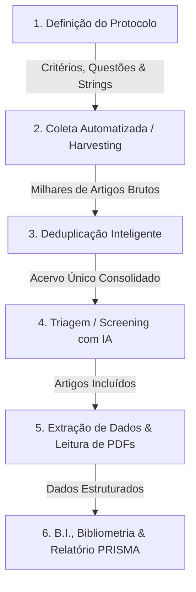

# 📖 Aula 01: Visão Geral, Domínio Científico e Propósito do Software

> **Revsist (RSAC V2)** — Revisão Sistemática Assistida por Computador  
> *Domínio Oficial: `revsist.com`*

---

## 1. O que é o Revsist?

O **Revsist** (anteriormente chamado pelo codinome de engenharia **RSAC V2**) é uma plataforma de software completa desenvolvida para automatizar, acelerar e garantir rigor metodológico na execução de **Revisões Sistemáticas da Literatura (RSL)** e **Mapeamentos Sistemáticos**.

Em pesquisas científicas de pós-graduação (mestrado, doutorado) e investigações acadêmicas avançadas, conduzir uma revisão de literatura tradicional é um processo que consome centenas de horas manuais, propenso a erros de triagem, perda de rastreabilidade e fadiga do pesquisador. 

O Revsist transforma esse processo em um fluxo de trabalho estruturado, auditável e potencializado por **Inteligência Artificial Generativa e Algoritmos de Recuperação da Informação**.

---

## 2. O Fluxo de Trabalho Científico (Metodologia PRISMA)

O software implementa rigorosamente a metodologia internacional **PRISMA 2020** (*Preferred Reporting Items for Systematic Reviews and Meta-Analyses*), dividida em 6 grandes etapas sequenciais:

### 📋 Etapa 1: Protocolo de Pesquisa
- O pesquisador define a questão norteadora (estrutura PICO / PECO).
- Cadastra os **Critérios de Inclusão** (ex: `INC01: Artigos empíricos sobre governança territorial`) e **Critérios de Exclusão** (ex: `EXC01: Estudos fora do recorte temporal ou focados em ensaios clínicos`).
- Configura os **Descritores de Busca** (organizados em pares de termos para compatibilidade com bases de indexação rígidas como a BDTD).

### 🌐 Etapa 2: Coleta Automatizada (Harvesters)
- O software conecta-se diretamente a múltiplas fontes acadêmicas: **SciELO** (via CrossRef API com prefixos de periódicos indexados), **BDTD** (via VuFind / OAI-PMH), **Scopus**, **PubMed**, etc.
- Permite paginação em segundo plano e notificação de progresso em tempo real (artigos encontrados, novos e duplicados).

### 🔍 Etapa 3: Deduplicação
- Como as bases indexam os mesmos artigos científicos, o Revsist aplica um motor de deduplicação em dois níveis:
  1. *Exato:* Comparação determinística de DOI (*Digital Object Identifier*).
  2. *Fuzzy / Similaridade Fonética e Textual:* Utiliza a biblioteca `RapidFuzz` com distância de Levenshtein normalizada sobre títulos e autores, permitindo limiares ajustáveis (ex: 85% de similaridade).

### 🤖 Etapa 4: Triagem Assistida por IA (Screening)
- Leitura automatizada de Título e Resumo através de LLMs (Google Gemini 2.5 Flash, OpenAI GPT-4o ou Ollama Local).
- A IA avalia cada artigo frente aos critérios cadastrados no protocolo, atribuindo:
  - **Decisão:** *Incluído*, *Excluído* ou *Pendente*.
  - **Grau de Confiança:** Percentual de certeza da decisão (ex: 95%).
  - **Justificativa Metodológica:** Explicação textual apontando os critérios que motivaram a decisão.
- Possibilidade de auditoria e revisão humana com 1 clique (Kanban de triagem e caixas de seleção interativas).

### 📄 Etapa 5: Extração de Dados e Gestão de PDFs
- Download automático e upload manual de artigos completos em PDF.
- Visualizador interno de PDFs com anotações e destaque de texto.
- Formulários dinâmicos de extração (metodologia adotada, tamanho da amostra, resultados-chave, variáveis de estudo).

### 📊 Etapa 6: Business Intelligence (B.I.), Bibliometria e Exportação
- Dashboard visual com métricas bibliométricas: evolução temporal de publicações, principais autores, periódicos mais produtivos, nuvens de palavras-chave.
- Geração automática do **Diagrama de Fluxo PRISMA 2020**.
- Exportação dos dados consolidados em Excel (`.xlsx`), CSV, BibTeX e formato JSON.

---

## 3. Os Dois Modos de Operação do Software

O Revsist foi projetado com uma arquitetura híbrida e desacoplada, capaz de rodar em dois perfis distintos sem alteração na lógica de negócio:

| Característica | 🖥️ Perfil Desktop (`desktop`) | ☁️ Perfil Servidor / Online (`server`) |
| :--- | :--- | :--- |
| **Público / Cenário** | Pesquisador individual rodando localmente no Windows. | Plataforma SaaS multi-usuário acessada via navegador em `revsist.com`. |
| **Banco de Dados** | SQLite autônomo em arquivo local (`rsac.db`). | PostgreSQL 16 com pooling de conexões e migrações versionadas. |
| **Autenticação** | Token local randômico gerado no startup (zero configuração). | Login seguro com Google (OAuth2 + PKCE) ou usuário e senha com hash Argon2id. |
| **Isolamento de Dados** | Monousuário isolado fisicamente na máquina do usuário. | Multi-tenant rígido: todo projeto, artigo e credencial pertence a um `owner_id`. |
| **Executável** | Janela nativa Electron contendo o backend Python embutido. | Container Docker rodando em VPS brasileira sob proxy seguro Caddy (TLS/HTTPS). |

---

Na próxima aula, vamos navegar pelo mapa de arquivos do projeto:  
👉 **[Aula 02: Mapa Completo de Pastas e Arquivos](./02_MAPA_DE_PASTAS_E_ARQUIVOS.md)**
