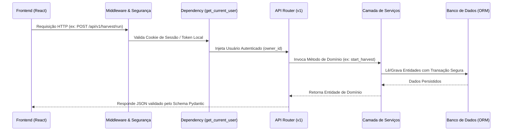

# ⚙️ Aula 03: Arquitetura e Engenharia do Backend

> **Como o Backend Python (FastAPI + SQLAlchemy + Alembic) funciona por dentro**

---

## 1. O Ciclo de Vida da Aplicação (`main.py` e Lifespan)

O backend é construído sobre o **FastAPI**, framework assíncrono de altíssima performance para Python.

Quando o backend inicia:
1. **Leitura de Configurações (`config.py`):** Carrega as variáveis de ambiente tipadas via `pydantic-settings` (modo de execução `desktop` vs `server`, caminhos de armazenamento de PDFs e credenciais).
2. **Inicialização do Banco (`database.py`):** Estabelece a conexão com a base de dados (SQLite local ou PostgreSQL em produção) e executa a verificação de integridade do esquema.
3. **Lifespan Context Manager:** Gerencia a inicialização e desligamento gracioso de recursos, como pools de conexão HTTP (`httpx.AsyncClient`) e tarefas em segundo plano.
4. **Middlewares de Segurança (`middleware.py`):** Configura cabeçalhos HTTP estritos (Content Security Policy, X-Frame-Options, HSTS) e limites de taxa de requisições.
5. **Roteamento Modular (`api/v1/router.py`):** Registra os endpoints divididos entre públicos (login, health) e protegidos (projetos, protocolos, triagem).



---

## 2. A Camada de Dados Híbrida (`database.py` e `models.py`)

Uma das maiores forças da arquitetura do Revsist é ser **híbrida e agnóstica de banco de dados**:

### 🔄 Dualidade SQLite & PostgreSQL
- **No Desktop:** O app conecta-se a um arquivo local SQLite (`sqlite:///rsac.db`) com `WAL mode` (*Write-Ahead Logging*), garantindo leituras rápidas e alta concorrência sem necessidade de instalar servidores de banco na máquina do pesquisador.
- **No Servidor / Nuvem:** O app utiliza o driver nativo `psycopg 3` conectado a um cluster PostgreSQL 16 com pool de conexões otimizado (`QueuePool`).

### 📦 Mapeamento Objeto-Relacional (SQLAlchemy ORM)
Todas as entidades do sistema são mapeadas em classes Python em `app/infrastructure/persistence/models.py`:
- `ProjectModel`: Metadados do projeto de revisão sistemática e vínculo com o usuário proprietário (`owner_id`).
- `ProtocolModel`: Questão norteadora, critérios de inclusão/exclusão e descritores booleanos.
- `PaperModel`: Os artigos científicos coletados (título, resumo, autores, ano, DOI, base de origem, status de triagem e justificativas).
- `HarvestRunModel`: Histórico e métricas de cada execução de busca nas bases.
- `AISettingsModel`: Configurações de modelo, temperatura e chaves de API cifradas.

### 🛡️ Migrações de Esquema com Alembic (`alembic/`)
Para garantir que o banco de dados possa evoluir ao longo do tempo sem perda de dados:
- Cada alteração estrutural no banco é registrada como uma migração imutável em `alembic/versions/`.
- No startup, o sistema detecta a versão atual e aplica as migrações automaticamente (`alembic upgrade head`), garantindo compatibilidade total.

---

## 3. A Camada de Serviços de Domínio (`services/`)

Seguindo o padrão de **Separação de Responsabilidades (SoC)**, os endpoints da API (`api/v1/`) nunca manipulam o banco diretamente ou realizam chamadas de rede externas. Eles apenas recebem requisições, validam DTOs e delegam a execução para a **Camada de Serviços**.

### Principais Serviços:
1. **`HarvestingService` (`harvesting_service.py`):**
   - Dispara tarefas assíncronas de busca usando `asyncio`.
   - Consulta os módulos Harvesters de forma resiliente.
   - Realiza a gravação atômica em lotes periódicos (ex: 25 artigos por transação) para que a interface receba progresso imediato.
2. **`ScreeningService` (`screening_service.py`):**
   - Gerencia a triagem manual e com Inteligência Artificial.
   - Implementa semáforo de concorrência (`asyncio.Semaphore(concurrency)`) para consultar múltiplos artigos em paralelo sem estourar limites de taxa (Rate Limits).
3. **`DedupService` (`dedup_service.py`):**
   - Executa algoritmos de fusão de duplicatas exatas por DOI e similares por distância de Levenshtein normalizada sobre títulos e autores.
4. **`PDFService` (`pdf_service.py`):**
   - Utiliza a biblioteca C `PyMuPDF` (Fitz) para ler, validar, extrair texto e indexar arquivos PDF de forma ultrarrápida.
5. **`InsightsService` (`insights_service.py`):**
   - Realiza agregações SQL complexas para alimentar os gráficos de bibliometria e evolução temporal da pesquisa.

---

## 4. Comunicação em Tempo Real via WebSocket (`websocket.py`)

Para processos longos (como coletar 10.000 artigos ou triar 500 estudos com IA), o Revsist não obriga o usuário a ficar atualizando a tela manualmente.

O `ConnectionManager` em `app/websocket.py`:
- Mantém conexões WebSocket ativas com os clientes conectados.
- Agrupa as conexões por `project_id`.
- Permite que qualquer serviço do backend envie mensagens de progresso instantâneas através de `ws_manager.broadcast(project_id, event_data)`.

Exemplo de evento de progresso transmitido em tempo real:
```json
{
  "type": "batch_screening_progress",
  "processed": 42,
  "total": 100,
  "percentage": 42.0,
  "current_paper_title": "Turismo e Governança Territorial no Brasil",
  "decision": "Incluído",
  "confidence": 0.96,
  "justification": "Atende ao critério INC01 (desenvolvimento regional e governança territorial)."
}
```

---

Na próxima aula, vamos dissecar o funcionamento dos coletores acadêmicos:  
👉 **[Aula 04: Motores de Coleta e Harvesters](./04_COLETORES_HARVESTERS.md)**
