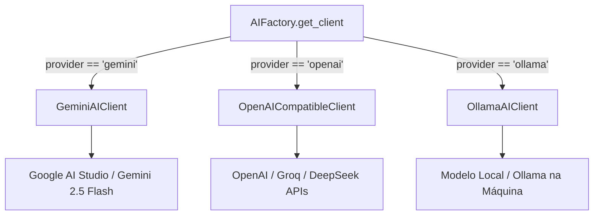

# 🤖 Aula 05: Motor de Inteligência Artificial e Triagem

> **Como o Revsist utiliza LLMs para triar centenas de estudos com rapidez, precisão e rigor científico**

---

## 1. O Papel da IA no Revsist

Em uma Revisão Sistemática tradicional, ler e avaliar 10.000 títulos e resumos consome semanas de trabalho repetitivo. 

No **Revsist**, a Inteligência Artificial atua como um assistente de pesquisa incansável: ela analisa o título e resumo de cada artigo frente aos critérios cadastrados no protocolo, sugere uma decisão (*Incluído* / *Excluído*), aponta quais critérios foram violados ou atendidos, calcula o nível de confiança estatística e elabora uma justificativa metodológica auditável.

---

## 2. A Fábrica de Provedores de IA (`AIFactory`)

O sistema adota o padrão **Factory** (`app/infrastructure/ai/factory.py`), permitindo que o pesquisador escolha o provedor de IA que preferir nas configurações:



---

## 3. O Cliente Google Gemini (`gemini_client.py`)

O **Google Gemini** é o provedor mais popular no Revsist devido à sua altíssima velocidade e janelas de contexto amplas.

### ⚡ Estratégia de Fallback e Modelos Suportados
O cliente prioriza os modelos mais eficientes e implementa fallback automático em cascata:
1. `gemini-2.5-flash` (Padrão: responde em ~1 a 3 segundos com alta taxa de acerto)
2. `gemini-flash-latest` (Fallback rápido)
3. `gemini-2.5-pro` (Fallback de alta precisão)

### 🔄 Rotação Inteligente de Chaves de API
Pesquisadores podem cadastrar múltiplas chaves de API gratuitas do Google AI Studio. O `GeminiAIClient`:
- Filtra apenas chaves com formato válido (`AIzaSy...`).
- Se uma chave atinge o limite de taxa (*HTTP 429 Rate Limit*), o cliente rotaciona automaticamente para a próxima chave sem interromper o processamento.
- Realiza pequenas pausas assíncronas calculadas (`await asyncio.sleep(...)`) para respeitar a cota do Google.

### 🧹 Limpeza e Extração de JSON Resiliente
Modelos generativos frequentemente devolvem respostas envolvidas em blocos de markdown (ex: ```` ```json { ... } ``` ````). O método `_clean_json()` utiliza expressões regulares para localizar e extrair o objeto JSON válido, garantindo que o parser nunca quebre.

---

## 4. Engenharia de Prompts (`prompts.py`)

A qualidade da decisão da IA depende diretamente de como as instruções são formuladas:

1. **Contexto Metodológico:** O prompt informa à IA a questão da revisão e detalha todos os critérios de inclusão e exclusão com seus códigos identificadores (ex: `[INC01]`, `[EXC01]`).
2. **Neutralidade e LGPD (L-11):** Os nomes dos autores são intencionalmente omitidos do prompt de triagem para evitar viés de autoridade e assegurar que a IA avalie estritamente o conteúdo do resumo.
3. **Contrato de Saída Estrito:** A IA é instruída a devolver exclusivamente um JSON estruturado com o seguinte esquema:

```json
{
  "decision": "Incluído",
  "confidence": 0.95,
  "criteria_matches": ["INC01"],
  "justification": "O estudo aborda o planejamento territorial do turismo no contexto de desenvolvimento regional sustentável."
}
```

---

## 5. Orquestração em Lote com Semáforo de Concorrência (`screening_service.py`)

Ao iniciar uma **Triagem em Lote** (ex: 100 artigos de uma só vez):

```python
semaphore = asyncio.Semaphore(concurrency) # Ex: 3 tarefas simultâneas

async def process_one(paper):
    async with semaphore:
        # Avalia o artigo com a IA e persiste no banco
        ...
```

### 🛡️ Resiliência por Artigo (Anti-Freeze)
- Cada artigo é processado de forma isolada dentro de um bloco `try/except`.
- Se um artigo falhar por instabilidade de rede ou erro na IA, o erro é registrado, o artigo permanece como *Pendente* com a descrição do erro, o contador de progresso é incrementado (`processed_count += 1`) e o evento WebSocket é emitido.
- **Resultado:** A fila de triagem avança fluidamente de 1 a 100 sem nunca congelar a interface do usuário.

---

Na próxima aula, vamos conhecer a camada visual e o processo desktop:  
👉 **[Aula 06: Arquitetura Frontend e Host Electron](./06_ARQUITETURA_FRONTEND_E_ELECTRON.md)**
