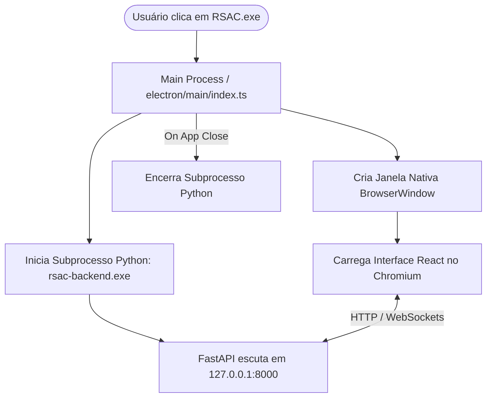

# 🖥️ Aula 06: Arquitetura Frontend e Host Electron

> **Como a interface React 18 e o empacotamento Electron criam a experiência nativa do Revsist**

---

## 1. A Pilha Tecnológica do Frontend

O frontend do Revsist é uma **Single Page Application (SPA)** de alta performance construída com:
- **React 18 & TypeScript:** Componentização declarativa, tipagem estática rigorosa e gerenciamento eficiente de estado.
- **Vite:** Ferramenta de build ultrarrápida com Hot Module Replacement (HMR).
- **Vanilla CSS com Design Tokens:** Controle total de layout, transições suaves, tipografia refinada e suporte nativo a temas (Light / Dark).
- **Electron 33:** Host nativo que empacota a aplicação web e o backend Python em um executável desktop Windows.

---

## 2. Estrutura de Layout e Design System

O Revsist adota uma interface moderna inspirada em suítes científicas e de produtividade avançada (Office Ribbon + Fluent Design):

```
+-------------------------------------------------------------------------+
| [Logotipo Revsist]   [Projetos] [Protocolo] [Coleta] [Triagem] [Extração] [B.I.] | -> TopRibbonBar
+-------------------------------------------------------------------------+
|                                                                         |
|                                                                         |
|                          ÁREA DE CONTEÚDO PRINCIPAL                      |
|                  (Renderiza a página ativa via Router)                  |
|                                                                         |
|                                                                         |
+-------------------------------------------------------------------------+
| [Status: Backend Conectado] [Base: SQLite] [Total de Artigos: 16.342]   | -> StatusBar
+-------------------------------------------------------------------------+
```

### Componentes de Estrutura:
1. **`TopRibbonBar.tsx`:** Barra superior que reúne os botões de ação rápida contextualizados para cada etapa da revisão.
2. **`StatusBar.tsx`:** Barra inferior persistente que monitora a conectividade com o backend, o tipo de banco ativo e o status dos processos em segundo plano.
3. **`index.css` & `theme/`:** Centraliza a paleta de cores (azuis profundos, tons de ardósia, destaques esmeralda para inclusões e rubi para exclusões), raios de borda, sombras e tipografia moderna.

---

## 3. As Páginas do Fluxo de Trabalho (`src/pages/`)

Cada tela corresponde a uma fase do método PRISMA:

| Página | Arquivo | Responsabilidade |
| :--- | :--- | :--- |
| **Projetos** | `ProjectsPage.tsx` | Criação, clonagem, backup e seleção do projeto ativo. |
| **Protocolo** | `ProtocolPage.tsx` | Definição da questão de pesquisa, critérios e descritores em pares. |
| **Coleta** | `HarvestPage.tsx` | Seleção de bases, disparo da coleta e medidor de progresso em tempo real. |
| **Triagem** | `ScreeningPage.tsx` | Kanban de artigos, filtros de busca, leitura de resumos e modal de triagem por IA. |
| **Extração** | `ExtractionPage.tsx` | Visualizador de PDF com campos laterais de extração estruturada. |
| **Insights** | `InsightsPage.tsx` | Dashboards interativos de bibliometria, evolução temporal e redes de termos. |
| **Exportação** | `ExportPage.tsx` | Download de relatórios PRISMA 2020 e planilhas Excel/CSV completas. |
| **Configurações** | `SettingsPage.tsx` | Configuração de chaves de API (Gemini/OpenAI) e preferências do sistema. |
| **Login** | `LoginPage.tsx` | Autenticação do pesquisador com senha ou Entrada com Google. |

---

## 4. Comunicação HTTP e WebSocket (`src/api/client.ts`)

A comunicação entre a interface e o servidor é centralizada no cliente **Axios** em `src/api/client.ts`:
- **Configuração Automática de URL:** No desktop, conecta-se a `http://127.0.0.1:8000`. Na versão online, conecta-se ao domínio `https://revsist.com`.
- **Credenciais Seguras:** Configurado com `withCredentials: true` para transmissão automática de cookies de sessão seguros.
- **Interceptors de Erro:** Trata expiração de sessão e redireciona para o login de forma transparente.

---

## 5. O Processo Host Electron (`frontend/electron/`)

No modo desktop, o **Electron** atua como uma casca nativa que integra o backend e o frontend em uma única janela:



### 🔒 Context Isolation e Preload Seguro (`preload/index.ts`)
O script de preload roda em um contexto isolado de memória (`contextBridge.exposeInMainWorld`), expondo para o React apenas comandos seguros de integração nativa (como abrir arquivos no explorador do Windows ou verificar a versão do app), eliminando riscos de segurança como injeção de scripts no Node.js.

---

Na próxima aula, vamos estudar a arquitetura de segurança e privacidade:  
👉 **[Aula 07: Segurança, Multi-Tenant e Conformidade LGPD](./07_SEGURANCA_LGPD_E_MULTI_TENANT.md)**
