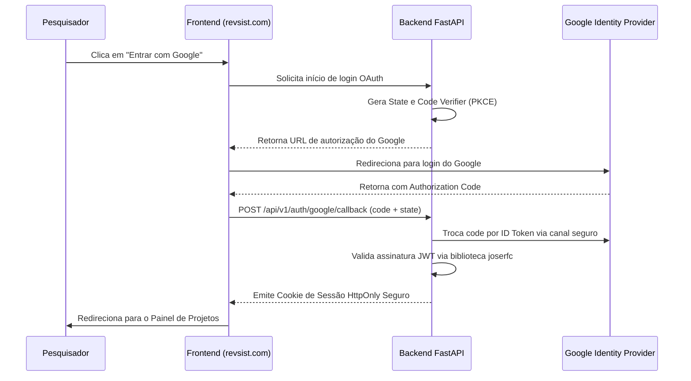

# 🛡️ Aula 07: Segurança, Multi-Tenant e Conformidade LGPD

> **Como o Revsist protege dados de pesquisa, credenciais e atende rigorosamente à Lei Geral de Proteção de Dados (Lei nº 13.709/2018)**

---

## 1. A Filosofia de Segurança do Revsist

Projetos de pesquisa acadêmica envolvem descobertas inéditas, propriedades intelectuais e dados sensíveis. Ao migrar de uma aplicação puramente de mesa para uma plataforma em nuvem (`revsist.com`), a segurança e a proteção de dados tornaram-se pilares centrais da arquitetura do software.

O Revsist adota o princípio de **Privacy and Security by Design**: a proteção não é um remendo posterior, mas parte integrante de cada consulta SQL, rota de API e tela de interface.

---

## 2. Isolamento Rígido Multi-Tenant (Titularidade de Dados)

Em um ambiente multi-usuário, o maior risco de segurança é o vazamento cruzado de dados entre pesquisadores (*Broken Object Level Authorization - BOLA*).

No Revsist:
1. **Chave de Titularidade:** Todas as tabelas de domínio (`projects`, `ai_settings`, `harvest_runs`) possuem obrigatoriamente a coluna `owner_id`.
2. **Injeção de Dependência (`security/dependencies.py`):**
   ```python
   async def get_current_project(project_id: str, current_user: UserModel = Depends(get_current_user), db: Session = Depends(get_db)):
       project = db.query(ProjectModel).filter(
           ProjectModel.id == project_id,
           ProjectModel.owner_id == current_user.id
       ).first()
       if not project:
           raise HTTPException(status_code=404, detail="Projeto não encontrado.")
       return project
   ```
3. **Impossibilidade Estrutural de Invasão:** Mesmo que um usuário mal-intencionado descubra o UUID de um projeto alheio e tente acessá-lo por URL direta ou chamada de API, a consulta retorna `404 Not Found` porque o filtro de `owner_id` é aplicado no nível do banco de dados.

---

## 3. Autenticação Moderna: Google OAuth2 + PKCE e Argon2id

O Revsist disponibiliza dois métodos de autenticação em produção:



### 🔑 Detalhes Criptográficos:
- **PKCE (*Proof Key for Code Exchange*):** Impede interceptação de códigos de autorização mesmo em redes públicas.
- **Validação Local de JWT com `joserfc`:** O backend valida a assinatura criptográfica dos tokens do Google usando o conjunto de chaves públicas do Google (JWKS), sem depender de chamadas síncronas lentas.
- **Hashing de Senhas com `Argon2id`:** Para login local por senha, o Revsist utiliza o algoritmo vencedor da *Password Hashing Competition*, imune a ataques por aceleração em GPUs.

---

## 4. Criptografia em Repouso (`security/secret_box.py`)

Chaves de API do Google Gemini, OpenAI ou Scopus cadastradas pelos usuários são dados ultrassensíveis.

- **Cifra Autenticada AES-GCM-256:** O módulo `secret_box.py` utiliza o padrão do NIST para criptografar as chaves de API antes de salvá-las no banco de dados.
- **Assinatura Anti-Adulteração:** O algoritmo AES-GCM gera uma tag de autenticação criptográfica; se qualquer byte for alterado no banco por terceiros, a chave é rejeitada no momento da leitura.

---

## 5. Conformidade Integral com a LGPD (Lei 13.709/2018)

O Revsist foi auditado contra os 69 itens do checklist de conformidade LGPD (documento `38_CHECKLIST_LGPD.md`):

1. **ROPA (*Record of Processing Activities*):** O modelo `processing_records` registra as operações de tratamento (login, disparo de IA, exportação de dados) armazenando apenas a categoria da ação e timestamp, **nunca gravando o conteúdo científico tratado**.
2. **Minimização de Dados na IA (L-11):** Os nomes dos autores são expurgados do prompt de triagem enviado às IAs externas.
3. **Direitos do Titular:**
   - `GET /api/v1/me/dados`: Devolve a declaração completa de dados do pesquisador.
   - `DELETE /api/v1/me`: Eliminação atômica e irreversível de conta, projetos, artigos e PDFs do disco.
4. **Cookies Seguros:** Cookies de sessão configurados com `HttpOnly`, `SameSite=Lax` e `Secure=True` (em HTTPS), impedindo qualquer acesso via scripts maliciosos (XSS).

---

Na próxima aula, vamos fechar com o pipeline de compilação e distribuição:  
👉 **[Aula 08: Ciclo de Build e Distribuição do Executável](./08_CICLO_DE_BUILD_E_DISTRIBUICAO.md)**
