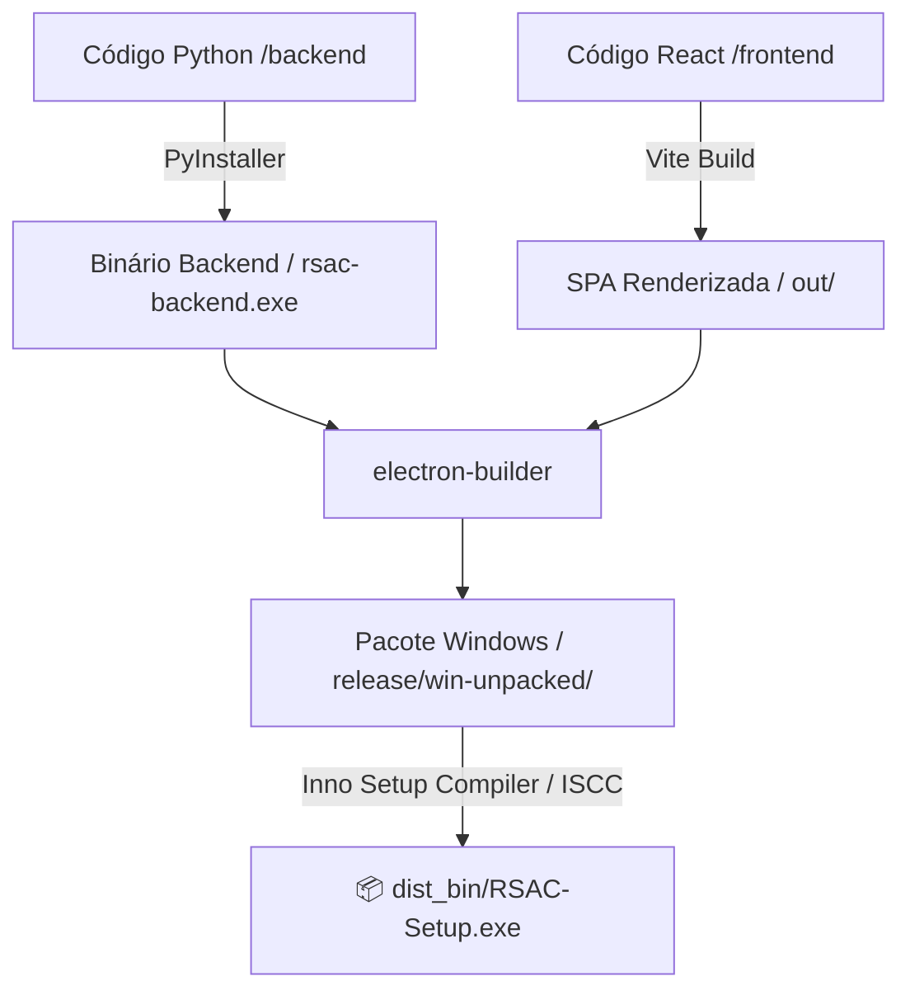

# 📦 Aula 08: Ciclo de Build e Distribuição do Executável

> **Como o código-fonte se transforma em um instalador comercial portátil para Windows (`RSAC-Setup.exe`)**

---

## 1. O Desafio de Distribuição do Software

O Revsist combina tecnologias complexas: um backend Python 3.12 com bibliotecas científicas de C/C++ (PyMuPDF, RapidFuzz, Torch, ONNX Runtime, Cryptography) e um frontend moderno em React 18 / Electron.

Para que qualquer pesquisador possa utilizar o software em seu computador Windows sem precisar instalar Python, Node.js, Git ou qualquer dependência técnica, o projeto conta com uma **esteira de compilação automatizada de ponta a ponta**.

---

## 2. O Pipeline Automatizado (`scripts/build_installer.py`)

A compilação de produção é orquestrada pelo script `build_installer.py`, estruturado em 4 etapas sequenciais:



---

### 🔹 Etapa 1: Compilação do Backend com PyInstaller
- O PyInstaller analisa o ponto de entrada do backend (`backend/app/main.py`) e o arquivo de especificação `rsac-backend.spec`.
- Coleta o interpretador Python embutido, todas as extensões binárias compiladas (`.pyd` / `.dll`), templates Alembic e bibliotecas de machine learning.
- O resultado é salvo na pasta de recursos do frontend:  
  `frontend/resources/backend/rsac-backend/` contendo o binário `rsac-backend.exe`.

### 🔹 Etapa 2: Compilação do Frontend com Vite
- O `electron-vite build` compila o TypeScript da interface do usuário em JavaScript e CSS minificados e otimizados para produção:
  - `out/main/index.js` (Processo principal Electron)
  - `out/preload/index.js` (Ponte segura IPC)
  - `out/renderer/` (Interface React em HTML/CSS/JS)

### 🔹 Etapa 3: Empacotamento do Electron
- O `electron-builder` reúne o executável do Electron (`RSAC V2.exe`), os arquivos compilados do React e a pasta do backend Python em uma estrutura nativa Windows em `frontend/release/win-unpacked/`.

### 🔹 Etapa 4: Geração do Instalador com Inno Setup
- O script gera dinamicamente um arquivo de configuração de instalação do **Inno Setup** (`.iss`).
- O compilador `ISCC.exe` comprime todo o ecossistema com algoritmo **LZMA2 ultra-sólido**, criando um único instalador autônomo:
  - **Caminho final:** [`dist_bin/RSAC-Setup.exe`](file:///d:/Downloads/RSACV2/RSACV2/dist_bin/RSAC-Setup.exe)
  - **Recursos do Instalador:** Cria atalhos no Menu Iniciar e na Área de Trabalho, associa ícones oficiais e inclui desinstalador limpo no Painel de Controle do Windows.

---

## 3. Como Executar e Compilar

### 💻 Ambiente de Desenvolvimento (Hot Reload):
Para testar alterações de código em tempo real durante o desenvolvimento:
```powershell
# Inicia backend e frontend em modo de desenvolvimento
.\Iniciar_RSAC.bat
```

### 🚀 Geração do Instalador de Produção:
Para gerar o executável final de distribuição comercial:
```powershell
python scripts/build_installer.py
```
Ao final do processo, o arquivo `dist_bin/RSAC-Setup.exe` estará pronto para distribuição direta aos pesquisadores e usuários finais.

---

## 🎓 Conclusão da Masterclass

Parabéns! Você completou a trilha técnica completa sobre o **Revsist (RSAC V2)**. 

Você agora domina a visão científica de Revisão Sistemática (PRISMA), a organização de pastas, a arquitetura de backend assíncrono, a resiliência dos coletores acadêmicos, a integração com Inteligência Artificial generativa, a interface React/Electron, a segurança multi-tenant sob a LGPD e o ciclo de build e empacotamento desktop!
