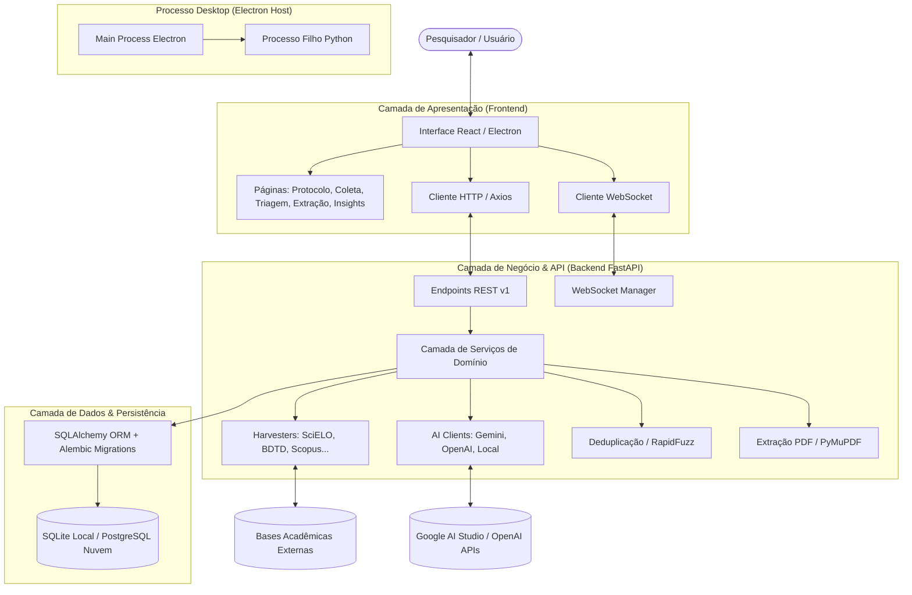

# 🎓 Masterclass de Arquitetura e Engenharia de Software: Revsist (RSAC V2)

> **Guia Didático e Documentação Completa de Funcionamento**  
> **Revisão Sistemática Assistida por Computador (RSAC V2 / Revsist)**  
> *Versão do Software: 2.0.0 | Domínio: `revsist.com`*

---

## 🎯 Objetivo Desta Trilha

Esta série de documentos foi estruturada pedagogicamente para explicar **linha por linha, pasta por pasta e conceito por conceito** como o software funciona. 

Ao final desta leitura, você compreenderá:
1. O propósito científico e metodológico do software (Revisão Sistemática da Literatura / PRISMA).
2. A topologia completa de diretórios e arquivos do repositório.
3. A engenharia interna do **Backend Python (FastAPI + SQLAlchemy + Alembic)**.
4. O funcionamento dos **Harvesters acadêmicos** (SciELO via CrossRef, BDTD, Scopus, PubMed).
5. O **Motor de Inteligência Artificial** (Google Gemini, OpenAI, Ollama), rotação de chaves e triagem assistida.
6. A interface e empacotamento desktop no **Frontend (React + Vite + Electron)**.
7. O ecossistema de **Segurança, Criptografia, Google OAuth2 e conformidade LGPD**.
8. O pipeline de **Build e Empacotamento Autônomo** para geração do `RSAC-Setup.exe`.

---

## 📚 Estrutura das Aulas e Módulos

| Módulo | Documento | Conteúdo Principal |
| :--- | :--- | :--- |
| **Aula 01** | [`01_VISAO_GERAL_E_DOMINIO.md`](./01_VISAO_GERAL_E_DOMINIO.md) | O que é o Revsist, fluxo PRISMA da RSL, e a dualidade Desktop vs Servidor Online. |
| **Aula 02** | [`02_MAPA_DE_PASTAS_E_ARQUIVOS.md`](./02_MAPA_DE_PASTAS_E_ARQUIVOS.md) | Dicionário visual de diretórios, arquivos-chave e a responsabilidade de cada componente. |
| **Aula 03** | [`03_ARQUITETURA_BACKEND.md`](./03_ARQUITETURA_BACKEND.md) | Ciclo de vida da requisição, Routers FastAPI, Camada de Serviços, Banco Híbrido e Alembic. |
| **Aula 04** | [`04_COLETORES_HARVESTERS.md`](./04_COLETORES_HARVESTERS.md) | Protocolos de busca acadêmica, engines (CrossRef/VuFind), normalização e prevenção de falsos zeros. |
| **Aula 05** | [`05_MOTOR_DE_IA_E_TRIAGEM.md`](./05_MOTOR_DE_IA_E_TRIAGEM.md) | Integração com LLMs, fallback de modelos, semáforo de concorrência e WebSockets ao vivo. |
| **Aula 06** | [`06_ARQUITETURA_FRONTEND_E_ELECTRON.md`](./06_ARQUITETURA_FRONTEND_E_ELECTRON.md) | Single Page Application (SPA), Design System Vanilla CSS, IPC Electron e ciclo de janelas. |
| **Aula 07** | [`07_SEGURANCA_LGPD_E_MULTI_TENANT.md`](./07_SEGURANCA_LGPD_E_MULTI_TENANT.md) | Isolamento multi-tenant, autenticação PKCE, cifra AES-GCM e direitos do titular LGPD (ROPA). |
| **Aula 08** | [`08_CICLO_DE_BUILD_E_DISTRIBUICAO.md`](./08_CICLO_DE_BUILD_E_DISTRIBUICAO.md) | Como o código-fonte vira um executável Windows portátil de distribuição comercial. |

---

## 🗺️ Mapa Conceitual da Aplicação

---

Vamos começar pela **[Aula 01: Visão Geral e Domínio do Software](./01_VISAO_GERAL_E_DOMINIO.md)**!
