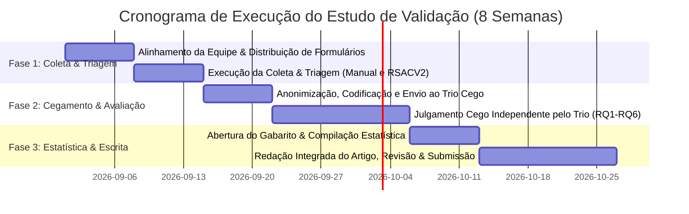

# PROJETO DE PESQUISA & PROPOSTA DE COAUTORIA CIENTÍFICA

**Título do Projeto:**  
> **Validação Experimental Pareada Cega da Ferramenta RSACV2 em Revisão de Escopo: Avaliação de Acurácia, Reprodutibilidade e Qualidade Metodológica em Ciências Sociais Aplicadas**

**Protocolo em Teste:**  
> *Impactos da Segurança Pública na Operacionalização do Turismo Náutico em Fronteiras Fluviais: Protocolo de Revisão de Escopo (PRISMA-ScR)*  
> **Referência:** Backup JSON (`rsac-perfil-backup-2026-08-19 (1).json` — ID `7847417c-79df-4892-bdec-2257d019f65e`)

---

## ✉️ Carta-Convite aos Colegas Pesquisadores

Prezados(as) Colegas e Pesquisadores(as),

Convidamos vocês formalmente a participar como **coautores(as) e pesquisadores(as) colaboradores(as)** deste projeto de pesquisa que visa validar experimentalmente a ferramenta **RSACV2 (Revisão Sistemática Assistida por Computador)**.

Este projeto foi desenhado com um método experimental inédito de **duplo-cegamento com trio de revisores independentes**, garantindo rigor científico, isenção e reprodutibilidade. A investigação gerará evidências empíricas de alto nível para submissão a periódicos científicos de alto impacto (**Qualis A1/A2 / JCR / Scopus**) nas áreas de *Desenvolvimento Regional, Políticas Públicas, Segurança Pública Territorial e Ciência da Informação*.

Todo o instrumental de coleta, triagem, extração e avaliação já está estruturado em planilhas padronizadas com validações automáticas, e o esqueleto do artigo já se encontra formatado e pronto para a consolidação dos dados.

---

## 1. 🎯 Objetivos e Questões de Pesquisa (Research Questions)

O projeto investiga como o desempenho da assistência computacional inteligente (RSACV2) se compara ao método manual humano na condução de uma revisão de escopo por meio de 6 perguntas:

1. **RQ1 (Coleta e Busca)**: Usando o mesmo protocolo de busca, em uma mesma base (BDTD e SciELO), os trabalhos encontrados são rigorosamente os mesmos em presença e ordem de aparição?
   * *Métrica 1.1*: `SIM` (100% igual); `NÃO - POR PRESENÇA`; `NÃO - POR ORDEM`; `NÃO INTEGRAL`.
2. **RQ2 (Concordância na Triagem)**: Em uma mesma lista de critérios de inclusão (CI1-CI3) e exclusão (CE1-CE3), as decisões de triagem serão as mesmas? E a qualidade da fundamentação das justificativas?
3. **RQ3 (Preferência em Divergências)**: Em caso de divergências de decisões e justificativas, qual é preferida por um trio de revisores independentes em análise cega?
   * *Métrica 3.1*: `Método A está correto`, `Método B está correto`, `Ambos divergem mas estão corretos` ou `Divergem mas ambos erram`.
4. **RQ4 (Discernibilidade / Teste de Turing)**: Os revisores independentes são capazes de discriminar qual resposta foi gerada pelo RSACV2? Sob qual grau de certeza (escala 1 a 5) e quais justificativas?
5. **RQ5 (Qualidade na Extração de Dados)**: Como se comparam as respostas das 5 questões de extração (QE1 a QE5) nos dois métodos sob avaliação cega (notas de concordância de 1 a 5 e extração preferida)?
6. **RQ6 (Síntese Qualitativa Global)**: Quais observações, padrões textuais e diferenças perceptíveis os revisores declaram sobre a confiabilidade e robustez do sistema?

---

## 2. 🔍 O Protocolo em Comum (Turismo Náutico & Fronteiras Fluviais)

* **Pergunta Norteadora**: *"Quais são as problemáticas de segurança pública registradas em fronteiras fluviais e de que maneira elas impactam o desenvolvimento e a operacionalização do turismo náutico nessas regiões?"*
* **Bases e Filtros**: BDTD e SciELO; Artigos, Teses e Dissertações nos idiomas Português, Inglês e Espanhol.
* **Descritores em Pares (Máximo 2 termos por expressão booleana)**:
  * *Português*: `"turismo náutico" AND "fronteira"`; `"segurança pública" AND "fronteira fluvial"`; `"turismo" AND "fronteira fluvial"`; `"turismo" AND "tríplice fronteira"`; `"segurança pública" AND "turismo náutico"`.
  * *Inglês*: `"nautical tourism" AND "border"`; `"public security" AND "river border"`; `"tourism" AND "river border"`; `"tourism" AND "cross-border"`; `"water tourism" AND "border"`.
  * *Espanhol*: `"turismo náutico" AND "frontera"`; `"seguridad pública" AND "frontera fluvial"`; `"turismo" AND "frontera fluvial"`; `"turismo" AND "triple frontera"`; `"turismo fluvial" AND "frontera"`.
* **Critérios de Elegibilidade**:
  * **CI1**: Atividade turística, náutica, recreativa ou navegação de passageiros em fronteiras fluviais/hidrovias.
  * **CI2**: Segurança pública, criminalidade transfronteiriça, fiscalização, policiamento ou governança em bacias de fronteira.
  * **CI3**: Publicações científicas completas (artigos, teses, dissertações).
  * **CE1**: Foco exclusivo em transporte marítimo oceânico/alto-mar.
  * **CE2**: Segurança urbana/rural sem qualquer conexão com hidrovias ou fronteiras fluviais.
  * **CE3**: Editoriais, resenhas ou resumos simples sem método.
* **Questões de Extração (QE1 a QE5)**:
  * **QE1**: Localização geográfica, país e bacia hidrográfica/rio de fronteira.
  * **QE2**: Tipologias de crimes, ilícitos transfronteiriços ou ocorrências de segurança.
  * **QE3**: Impactos na atratividade, infraestrutura e dinâmica operacional do turismo náutico.
  * **QE4**: Governança transfronteiriça, políticas públicas e medidas mitigatórias recomendadas.
  * **QE5**: Metodologia de pesquisa empregada e fontes de dados utilizadas.

---

## 3. 👥 Estrutura da Equipe e Papéis de Colaboração

| Núcleo / Papel | Quantidade Sugerida | Atribuições Principais |
| :--- | :---: | :--- |
| **1. Coordenação Geral & Cegamento** | 1 a 2 pesquisadores | Gestão do cronograma, geração das saídas do RSACV2, anonimização e aleatorização dos formulários (Método A vs. B), guarda do gabarito e compilação estatística (Kappa de Cohen/Fleiss). |
| **2. Pesquisadores Executores (Manual)** | 1 a 2 pesquisadores | Realização da busca manual independente, preenchimento da triagem e extração na planilha padronizada sem contato com o RSACV2. |
| **3. Comitê de Avaliadores Cego** | 3 pesquisadores (Trio) | Avaliação cega e independente da planilha codificada (RQ1 a RQ6, julgamento da coleta, preferência em divergências, teste de Turing, notas de extração e parecer qualitativo). |
| **4. Redação Científica & Coautoria** | Todos os integrantes | Redação e revisão crítica das seções do manuscrito (Introdução, Metodologia, Resultados, Discussão e Conclusão) e aprovação final da submissão. |

---

## 4. 📅 Cronograma de Execução (8 Semanas)

---

## 5. 📑 Documentos Disponíveis no Projeto

Todos os arquivos estão organizados na pasta [`d:\Downloads\RSACV2\RSACV2\estudo_validacao`](file:///d:/Downloads/RSACV2/RSACV2/estudo_validacao):

1. 📄 **[`Projeto_de_Pesquisa_Proposta_Validacao_RSACV2.docx`](file:///d:/Downloads/RSACV2/RSACV2/estudo_validacao/Projeto_de_Pesquisa_Proposta_Validacao_RSACV2.docx)**: Documento formal do projeto de pesquisa formatado para apresentação e formalização da equipe.
2. 📝 **[`Artigo_Esqueleto_Validacao_RSACV2.docx`](file:///d:/Downloads/RSACV2/RSACV2/estudo_validacao/Artigo_Esqueleto_Validacao_RSACV2.docx)**: Esqueleto completo do artigo científico com seções teóricas, metodologia, tabelas de resultados e referências.
3. 📊 **[`Formulario_Pesquisadores_Triagem_Extracao.xlsx`](file:///d:/Downloads/RSACV2/RSACV2/estudo_validacao/Formulario_Pesquisadores_Triagem_Extracao.xlsx)**: Planilha dos pesquisadores executores (Busca, Triagem e Extração).
4. ⚖️ **[`Formulario_Avaliadores_Revisao_Cega.xlsx`](file:///d:/Downloads/RSACV2/RSACV2/estudo_validacao/Formulario_Avaliadores_Revisao_Cega.xlsx)**: Planilha do Trio de Revisores Independentes com cegamento duplo e gabarito restrito da coordenação.

---

## 6. ✍️ Ficha de Adesão e Manifestação de Interesse

Para confirmar seu interesse em integrar a pesquisa e a coautoria do artigo, favor indicar:

* **Nome Completo:** __________________________________________________
* **Instituição / Programa de Pós-Graduação:** ____________________________
* **E-mail / WhatsApp:** _______________________________________________
* **Papel de Preferência:**  
  * `( )` Pesquisador Executor (Braço Manual)  
  * `( )` Revisor Independente (Trio Cego)  
  * `( )` Redator / Analista de Dados  
