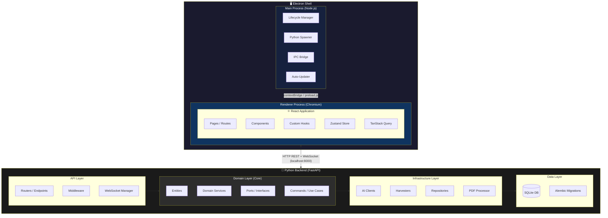
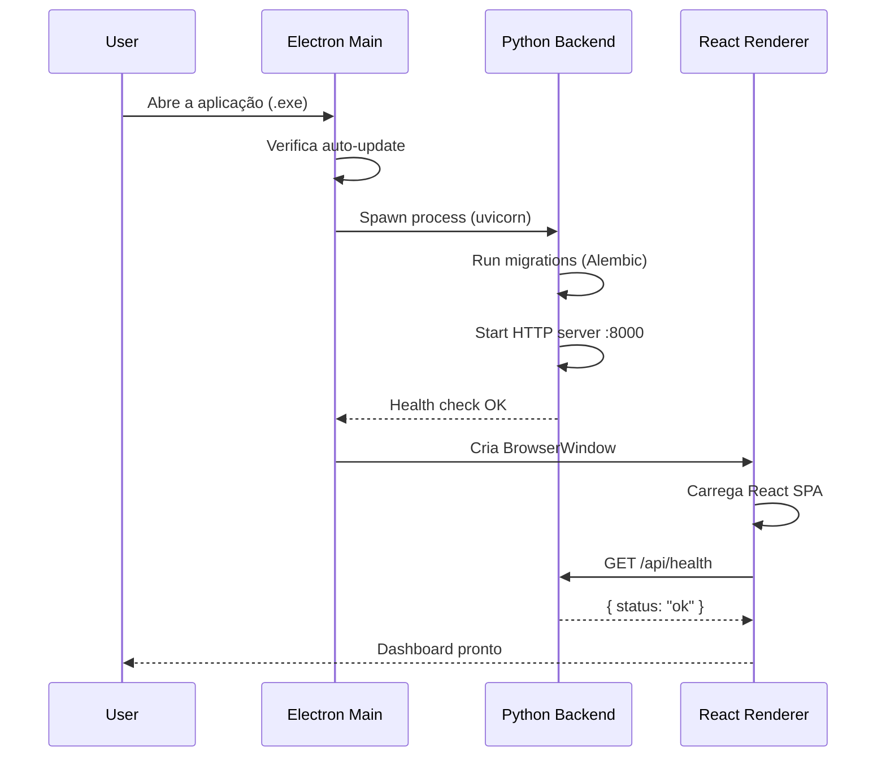

# 04 — Arquitetura Geral

> Diagrama de camadas, fluxo de dados e contratos de comunicação Backend ↔ Electron.

---

## 4.1 Diagrama de Arquitetura em Camadas



---

## 4.2 Fluxo de Inicialização



---

## 4.3 Modelo de Comunicação

### 4.3.1 Frontend ↔ Backend (HTTP REST)

O React (Renderer) se comunica com o Python (FastAPI) via HTTP local:

```
http://localhost:8000/api/v1/...
```

| Método | Padrão | Uso |
|--------|--------|-----|
| `GET` | Leitura | Listar projetos, papers, configurações |
| `POST` | Criação | Criar projeto, iniciar harvesting, iniciar triagem |
| `PUT` | Atualização | Atualizar paper, protocolo, configurações |
| `DELETE` | Remoção | Excluir projeto, paper |

### 4.3.2 Frontend ↔ Backend (WebSocket)

Para operações de longa duração com feedback em tempo real:

```
ws://localhost:8000/ws/tasks/{task_id}
```

| Evento | Payload | Uso |
|--------|---------|-----|
| `harvest:progress` | `{ source, current, total, paper_title }` | Progresso do harvester |
| `screening:progress` | `{ current, total, paper_id, decision }` | Progresso da triagem em lote |
| `extraction:progress` | `{ current, total, paper_id }` | Progresso da extração de PDFs |
| `task:completed` | `{ task_id, result_summary }` | Tarefa concluída |
| `task:error` | `{ task_id, error_message }` | Erro em tarefa |

### 4.3.3 Electron Main ↔ Renderer (IPC)

Comunicação via `contextBridge` (segura, sem `nodeIntegration`):

```typescript
// preload.ts — API exposta ao renderer
contextBridge.exposeInMainWorld('electronAPI', {
  // Diálogos nativos
  showOpenDialog: (options) => ipcRenderer.invoke('dialog:open', options),
  showSaveDialog: (options) => ipcRenderer.invoke('dialog:save', options),

  // Sistema de arquivos (seleção de pastas)
  selectDirectory: () => ipcRenderer.invoke('fs:selectDirectory'),

  // Informações do sistema
  getAppVersion: () => ipcRenderer.invoke('app:version'),
  getPlatform: () => ipcRenderer.invoke('app:platform'),

  // Auto-update
  checkForUpdates: () => ipcRenderer.invoke('updater:check'),
  onUpdateAvailable: (callback) => ipcRenderer.on('updater:available', callback),
  onUpdateDownloaded: (callback) => ipcRenderer.on('updater:downloaded', callback),

  // Notificações nativas
  showNotification: (title, body) => ipcRenderer.invoke('notification:show', title, body),
})
```

---

## 4.4 Princípios Arquiteturais

### 🏗️ Clean Architecture (Backend)

```
┌─────────────────────────────────┐
│         API / Routers           │  ← Adaptadores de entrada (HTTP)
├─────────────────────────────────┤
│    Application / Use Cases      │  ← Orquestração de domínio
├─────────────────────────────────┤
│       Domain / Entities         │  ← Regras de negócio puras
├─────────────────────────────────┤
│   Infrastructure / Adapters     │  ← Adaptadores de saída (DB, AI, HTTP)
└─────────────────────────────────┘
```

**Regra de Dependência**: As camadas internas NUNCA dependem das externas.

### 📖 Separação API/Client (Livro "JavaScript Everywhere")

O livro de Adam D. Scott enfatiza:
> *"By building our API as a standalone code base, we can more easily evolve the code, debug, and test our application."*

No RSAC V2:
- O backend Python é **completamente independente** — pode rodar standalone como servidor
- O frontend React é **completamente independente** — pode conectar a qualquer instância do backend
- O Electron é apenas o **shell de distribuição** — gerencia lifecycle e empacotamento

---

## 4.5 Segurança

| Aspecto | Implementação |
|---------|---------------|
| **nodeIntegration** | `false` — nenhum acesso Node.js no renderer |
| **contextIsolation** | `true` — preload.js isolado via contextBridge |
| **Content Security Policy** | `default-src 'self'; connect-src http://localhost:8000 ws://localhost:8000` |
| **Credenciais** | Armazenadas encriptadas via `safeStorage` do Electron |
| **CORS** | Backend aceita apenas `http://localhost:*` (origem local) |
| **Porta do Backend** | Dinâmica (porta aleatória disponível) — evita conflito |
