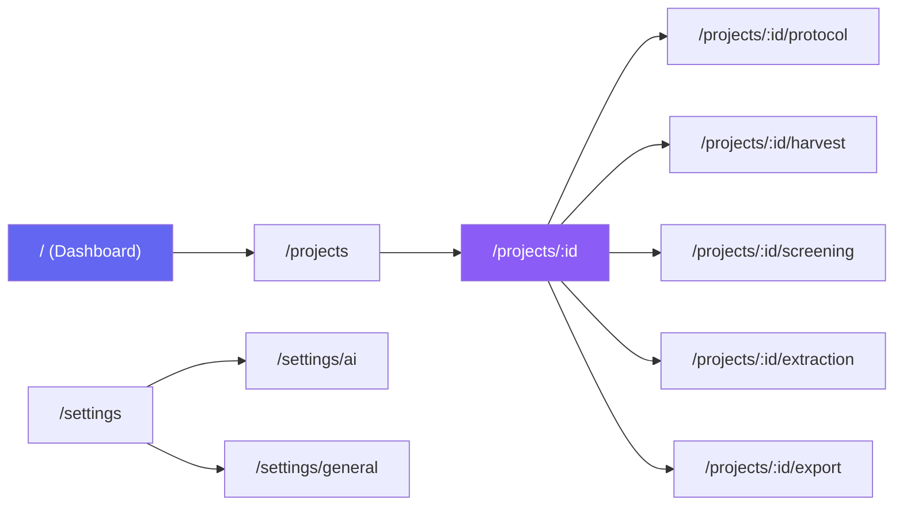

# 06 — Frontend Electron

> Estrutura do Electron, processo Main/Renderer, React, navegação, UX e design system.

---

## 6.1 Modelo de Processos do Electron

📖 *Referência: Capítulo 21-22 do livro "JavaScript Everywhere"*

```
┌─────────────────────────────────────────────────────┐
│                 ELECTRON APPLICATION                 │
│                                                      │
│  ┌────────────────────┐  ┌────────────────────────┐ │
│  │   MAIN PROCESS     │  │  RENDERER PROCESS      │ │
│  │   (Node.js)        │  │  (Chromium)             │ │
│  │                    │  │                          │ │
│  │  • app lifecycle   │  │  • React 19 SPA          │ │
│  │  • BrowserWindow   │  │  • HTML/CSS/JS            │ │
│  │  • Python spawn    │←→│  • Zustand store          │ │
│  │  • IPC handlers    │  │  • TanStack Query         │ │
│  │  • Auto-updater    │  │  • Radix UI components    │ │
│  │  • Native dialogs  │  │  • WebSocket client       │ │
│  │  • Tray icon       │  │                          │ │
│  │  • Menu bar        │  │  Comunicação:            │ │
│  │                    │  │  → Backend via HTTP      │ │
│  │  Comunicação:      │  │  → Main via IPC          │ │
│  │  → Renderer via IPC│  │                          │ │
│  │  → Backend via HTTP│  │                          │ │
│  └────────────────────┘  └────────────────────────┘ │
└─────────────────────────────────────────────────────┘
```

---

## 6.2 Estrutura do Projeto Electron + React

```
frontend/
├── electron/                       # Electron Main Process
│   ├── main.ts                     # Entry point — app lifecycle
│   ├── preload.ts                  # contextBridge API
│   ├── python-manager.ts           # Spawn/kill do backend Python
│   ├── updater.ts                  # electron-updater config
│   ├── menu.ts                     # Menu bar nativo
│   └── ipc-handlers.ts            # Handlers IPC (dialogs, fs, etc.)
│
├── src/                            # React Application (Renderer)
│   ├── main.tsx                    # React entry point
│   ├── App.tsx                     # Root component + Router
│   │
│   ├── api/                        # Camada de comunicação HTTP
│   │   ├── client.ts               # HTTP client configurado (ky/fetch)
│   │   ├── endpoints.ts            # URLs e funções de API
│   │   └── websocket.ts            # WebSocket client para tarefas
│   │
│   ├── stores/                     # Estado global (Zustand)
│   │   ├── useProjectStore.ts
│   │   ├── useSettingsStore.ts
│   │   └── useTaskStore.ts
│   │
│   ├── hooks/                      # Custom hooks
│   │   ├── useProjects.ts          # TanStack Query hooks para projetos
│   │   ├── usePapers.ts
│   │   ├── useScreening.ts
│   │   ├── useHarvesting.ts
│   │   └── useWebSocket.ts
│   │
│   ├── pages/                      # Páginas / Rotas
│   │   ├── DashboardPage.tsx
│   │   ├── ProjectListPage.tsx
│   │   ├── ProjectDetailPage.tsx
│   │   ├── ProtocolPage.tsx
│   │   ├── HarvestingPage.tsx
│   │   ├── ScreeningPage.tsx
│   │   ├── ExtractionPage.tsx
│   │   ├── SettingsPage.tsx
│   │   └── ExportPage.tsx
│   │
│   ├── components/                 # Componentes reutilizáveis
│   │   ├── layout/
│   │   │   ├── AppShell.tsx        # Layout principal (sidebar + content)
│   │   │   ├── Sidebar.tsx
│   │   │   ├── Header.tsx
│   │   │   └── Breadcrumbs.tsx
│   │   ├── common/
│   │   │   ├── Button.tsx
│   │   │   ├── Card.tsx
│   │   │   ├── Badge.tsx
│   │   │   ├── Input.tsx
│   │   │   ├── Select.tsx
│   │   │   ├── Modal.tsx
│   │   │   ├── DataTable.tsx
│   │   │   ├── ProgressBar.tsx
│   │   │   ├── EmptyState.tsx
│   │   │   ├── LoadingSpinner.tsx
│   │   │   └── SearchInput.tsx
│   │   ├── domain/
│   │   │   ├── PaperCard.tsx
│   │   │   ├── PaperDetailPanel.tsx
│   │   │   ├── ProtocolForm.tsx
│   │   │   ├── CriteriaEditor.tsx
│   │   │   ├── ScreeningControls.tsx
│   │   │   ├── HarvesterStatus.tsx
│   │   │   ├── PrismaFlowchart.tsx
│   │   │   ├── AIProviderConfig.tsx
│   │   │   └── MethodologySelector.tsx
│   │   └── charts/
│   │       ├── StatsCounter.tsx
│   │       ├── DecisionPieChart.tsx
│   │       └── TimelineChart.tsx
│   │
│   ├── styles/                     # Design System CSS
│   │   ├── globals.css             # Reset + CSS variables (design tokens)
│   │   ├── themes/
│   │   │   ├── light.css
│   │   │   └── dark.css
│   │   └── components/             # CSS Modules por componente
│   │       ├── Button.module.css
│   │       ├── Card.module.css
│   │       └── ...
│   │
│   ├── lib/                        # Utilitários
│   │   ├── constants.ts
│   │   ├── formatters.ts
│   │   └── validators.ts
│   │
│   └── types/                      # TypeScript types
│       ├── api.ts                  # Tipos espelhando schemas Pydantic
│       ├── electron.d.ts           # Tipos do contextBridge
│       └── domain.ts               # Enums e types de domínio
│
├── public/
│   ├── icon.png
│   └── splash.html                 # Tela de carregamento inicial
│
├── electron-builder.yml            # Configuração de build/empacotamento
├── electron.vite.config.ts         # Vite config para Electron
├── package.json
├── tsconfig.json
└── tsconfig.node.json
```

---

## 6.3 Navegação e Rotas



### Layout: AppShell

```
┌──────────────────────────────────────────────────┐
│  Header (título do projeto + breadcrumbs)         │
├──────────┬───────────────────────────────────────┤
│          │                                        │
│ Sidebar  │          Main Content Area             │
│          │                                        │
│ • Dash   │    (Renderizado pelo React Router)     │
│ • Projts │                                        │
│ • Config │                                        │
│          │                                        │
│ ──────── │                                        │
│ Projeto: │                                        │
│ • Proto  │                                        │
│ • Coleta │                                        │
│ • Triag  │                                        │
│ • Extra  │                                        │
│ • Export │                                        │
│          │                                        │
├──────────┴───────────────────────────────────────┤
│  Status Bar (tarefas ativas, progresso)           │
└──────────────────────────────────────────────────┘
```

---

## 6.4 Design System (Tokens CSS)

```css
/* styles/globals.css */

:root {
  /* Cores Base (Light Theme) */
  --color-bg-primary: #fafafa;
  --color-bg-secondary: #ffffff;
  --color-bg-tertiary: #f3f4f6;
  --color-bg-elevated: #ffffff;

  --color-text-primary: #111827;
  --color-text-secondary: #4b5563;
  --color-text-tertiary: #9ca3af;

  --color-border: #e5e7eb;
  --color-border-focus: #6366f1;

  /* Accent */
  --color-accent: #6366f1;
  --color-accent-hover: #4f46e5;
  --color-accent-subtle: #eef2ff;

  /* Semânticas */
  --color-success: #10b981;
  --color-warning: #f59e0b;
  --color-error: #ef4444;
  --color-info: #3b82f6;

  /* Tipografia */
  --font-sans: 'Inter', system-ui, -apple-system, sans-serif;
  --font-mono: 'JetBrains Mono', 'Fira Code', monospace;

  --text-xs: 0.75rem;
  --text-sm: 0.875rem;
  --text-base: 1rem;
  --text-lg: 1.125rem;
  --text-xl: 1.25rem;
  --text-2xl: 1.5rem;
  --text-3xl: 1.875rem;

  /* Espaçamento */
  --space-1: 0.25rem;
  --space-2: 0.5rem;
  --space-3: 0.75rem;
  --space-4: 1rem;
  --space-6: 1.5rem;
  --space-8: 2rem;
  --space-12: 3rem;

  /* Bordas */
  --radius-sm: 0.375rem;
  --radius-md: 0.5rem;
  --radius-lg: 0.75rem;
  --radius-xl: 1rem;

  /* Sombras */
  --shadow-sm: 0 1px 2px rgba(0, 0, 0, 0.05);
  --shadow-md: 0 4px 6px -1px rgba(0, 0, 0, 0.1);
  --shadow-lg: 0 10px 15px -3px rgba(0, 0, 0, 0.1);
  --shadow-xl: 0 20px 25px -5px rgba(0, 0, 0, 0.1);

  /* Transições */
  --transition-fast: 150ms cubic-bezier(0.4, 0, 0.2, 1);
  --transition-base: 200ms cubic-bezier(0.4, 0, 0.2, 1);
  --transition-slow: 300ms cubic-bezier(0.4, 0, 0.2, 1);

  /* Layout */
  --sidebar-width: 260px;
  --header-height: 56px;
  --statusbar-height: 32px;
}

/* Dark Theme Override */
[data-theme="dark"] {
  --color-bg-primary: #0f0f0f;
  --color-bg-secondary: #171717;
  --color-bg-tertiary: #262626;
  --color-bg-elevated: #1e1e1e;

  --color-text-primary: #f9fafb;
  --color-text-secondary: #d1d5db;
  --color-text-tertiary: #6b7280;

  --color-border: #374151;
  --color-accent-subtle: #1e1b4b;

  --shadow-sm: 0 1px 2px rgba(0, 0, 0, 0.3);
  --shadow-md: 0 4px 6px -1px rgba(0, 0, 0, 0.4);
}
```

---

## 6.5 Electron Main Process — Gerenciamento do Python

📖 *Referência: Capítulo 21 do livro — "Electron" — gerenciamento de processos*

```typescript
// electron/python-manager.ts

import { spawn, ChildProcess } from 'child_process';
import { app } from 'electron';
import path from 'path';
import net from 'net';

class PythonManager {
  private process: ChildProcess | null = null;
  private port: number = 0;

  /**
   * Encontra uma porta TCP disponível.
   */
  private async findFreePort(): Promise<number> {
    return new Promise((resolve) => {
      const server = net.createServer();
      server.listen(0, () => {
        const port = (server.address() as net.AddressInfo).port;
        server.close(() => resolve(port));
      });
    });
  }

  /**
   * Inicia o backend Python (FastAPI + uvicorn).
   */
  async start(): Promise<number> {
    this.port = await this.findFreePort();

    const pythonPath = app.isPackaged
      ? path.join(process.resourcesPath, 'backend', 'python.exe')
      : 'python';

    const scriptPath = app.isPackaged
      ? path.join(process.resourcesPath, 'backend', 'run.py')
      : path.join(__dirname, '..', '..', 'backend', 'run.py');

    this.process = spawn(pythonPath, [
      scriptPath,
      '--port', String(this.port),
      '--host', '127.0.0.1',
    ]);

    // Aguarda health check
    await this.waitForReady();
    return this.port;
  }

  /**
   * Aguarda o backend responder ao health check.
   */
  private async waitForReady(timeoutMs = 30000): Promise<void> {
    const start = Date.now();
    while (Date.now() - start < timeoutMs) {
      try {
        const res = await fetch(
          `http://127.0.0.1:${this.port}/api/v1/health`
        );
        if (res.ok) return;
      } catch { /* retry */ }
      await new Promise(r => setTimeout(r, 500));
    }
    throw new Error('Python backend failed to start');
  }

  /**
   * Encerra o processo Python gracefully.
   */
  async stop(): Promise<void> {
    if (this.process) {
      this.process.kill('SIGTERM');
      this.process = null;
    }
  }

  get apiPort(): number {
    return this.port;
  }
}

export const pythonManager = new PythonManager();
```

---

## 6.6 Preload Script (Segurança)

📖 *Referência: Capítulo 22 do livro — segurança do Electron*

```typescript
// electron/preload.ts

import { contextBridge, ipcRenderer } from 'electron';

contextBridge.exposeInMainWorld('electronAPI', {
  // Informações do sistema
  getAppVersion: () => ipcRenderer.invoke('app:version'),
  getPlatform: () => ipcRenderer.invoke('app:platform'),
  getBackendPort: () => ipcRenderer.invoke('backend:port'),

  // Diálogos nativos
  showOpenDialog: (options: Electron.OpenDialogOptions) =>
    ipcRenderer.invoke('dialog:open', options),
  showSaveDialog: (options: Electron.SaveDialogOptions) =>
    ipcRenderer.invoke('dialog:save', options),

  // Sistema de arquivos
  selectPDFDirectory: () =>
    ipcRenderer.invoke('fs:selectPDFDirectory'),

  // Auto-update
  checkForUpdates: () => ipcRenderer.invoke('updater:check'),
  installUpdate: () => ipcRenderer.invoke('updater:install'),
  onUpdateAvailable: (callback: Function) =>
    ipcRenderer.on('updater:available', (_event, info) => callback(info)),
  onUpdateProgress: (callback: Function) =>
    ipcRenderer.on('updater:progress', (_event, progress) => callback(progress)),

  // Notificação nativa
  showNotification: (title: string, body: string) =>
    ipcRenderer.invoke('notification:show', { title, body }),

  // Tema do sistema
  getSystemTheme: () => ipcRenderer.invoke('theme:system'),
  onThemeChanged: (callback: Function) =>
    ipcRenderer.on('theme:changed', (_event, theme) => callback(theme)),
});
```

---

## 6.7 UX — Wireframes de Referência

### Dashboard Principal
```
┌─────────────────────────────────────────────────────────────┐
│  RSAC v2                              🔔  ⚙️  🌙/☀️       │
├────────────┬────────────────────────────────────────────────┤
│            │                                                │
│  📊 Dash   │  Boas-vindas, Eduardo!                        │
│  📁 Projs  │                                                │
│  ⚙️ Config │  ┌──────────┐ ┌──────────┐ ┌──────────┐      │
│            │  │ 3 Projts │ │ 1.247    │ │ 89%      │      │
│ ─────────  │  │ ativos   │ │ papers   │ │ triados  │      │
│            │  └──────────┘ └──────────┘ └──────────┘      │
│ Projeto:   │                                                │
│ "Saúde..." │  ┌─────────────────────────────────────────┐  │
│            │  │          PRISMA Flowchart               │  │
│  📋 Proto  │  │  Identificação → Triagem → Elegibilidade│  │
│  🔍 Coleta │  │  → Incluídos                            │  │
│  ✅ Triag  │  └─────────────────────────────────────────┘  │
│  📄 Extra  │                                                │
│  📤 Export │  ┌────────────────┐ ┌────────────────────┐    │
│            │  │ 🥧 Decisões    │ │ 📈 Coleta/mês      │    │
│            │  │ [Pie Chart]    │ │ [Line Chart]        │    │
│            │  └────────────────┘ └────────────────────┘    │
├────────────┴────────────────────────────────────────────────┤
│  🟢 Backend OK │ ⏳ Coleta BDTD: 45/120 │ v2.0.0          │
└─────────────────────────────────────────────────────────────┘
```

### Tela de Triagem
```
┌─────────────────────────────────────────────────────────────┐
│  Triagem de Trabalhos          🔍 Buscar...    [Filtros ▾]  │
├────────────┬────────────────────────────────────────────────┤
│            │                                                │
│ Lista de   │  📄 Paper Selecionado                         │
│ Papers     │  ───────────────────                          │
│            │  Título: Lorem ipsum dolor sit amet...         │
│ ┌────────┐ │  Autores: Silva, J.; Santos, M.               │
│ │ 📄 #1  │ │  Ano: 2024 │ Base: SciELO                    │
│ │ 🟢 Inc │ │                                                │
│ ├────────┤ │  Resumo:                                       │
│ │ 📄 #2  │ │  "Lorem ipsum dolor sit amet, consectetur     │
│ │ 🔴 Exc │ │   adipiscing elit. Sed do eiusmod tempor..."  │
│ ├────────┤ │                                                │
│ │ 📄 #3  │ │  Critérios de Inclusão:                       │
│ │ 🟡 Pend│ │  ☑ Estudo empírico   ☐ Revisado por pares    │
│ ├────────┤ │                                                │
│ │ 📄 #4  │ │  Critérios de Exclusão:                       │
│ │ 🟡 Pend│ │  ☐ Fora do escopo    ☐ Idioma inadequado     │
│ └────────┘ │                                                │
│            │  ┌──────────┐ ┌──────────┐ ┌──────────┐      │
│ Pg 1/45    │  │ ✅ Incluir│ │ ❌ Excluir│ │ 🤖 IA    │      │
│            │  └──────────┘ └──────────┘ └──────────┘      │
├────────────┴────────────────────────────────────────────────┤
│  Papers: 1247 │ Incluídos: 89 │ Excluídos: 1023 │ Pend:135│
└─────────────────────────────────────────────────────────────┘
```
