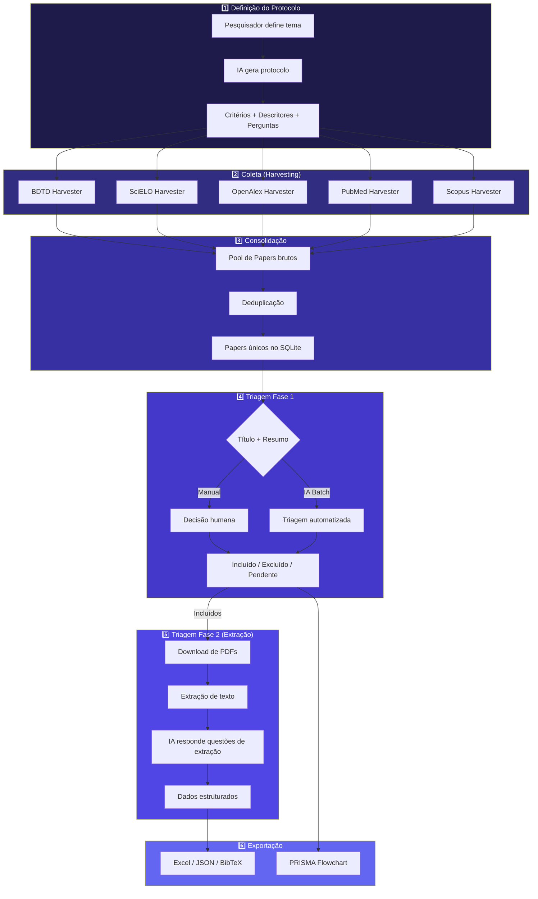
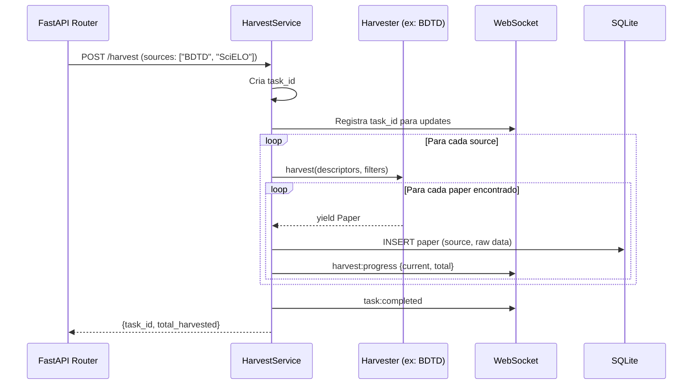
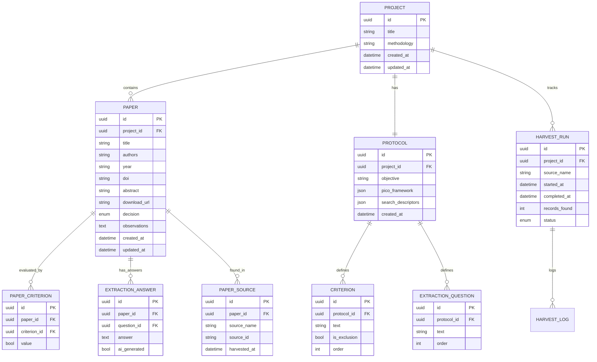

# 08 — Pipeline de Dados

> Fluxo end-to-end: Harvesters → Deduplicação → Triagem → Extração.

---

## 8.1 Visão Geral do Pipeline



---

## 8.2 Etapa 1: Definição do Protocolo

### Input
- Descrição textual do tema de pesquisa (prompt do usuário)
- Seleção da metodologia (PRISMA-P, Campbell, CEE/ROSES, EBSE, etc.)

### Processamento (AI Assistant Service)
1. Enviar prompt ao provedor de IA com template da metodologia selecionada
2. Receber JSON estruturado com:
   - Questões de pesquisa (PICO/PCC/SPICE/PECO)
   - Critérios de inclusão (máx. 10)
   - Critérios de exclusão (máx. 10)
   - Descritores de busca (máx. 5 pares por idioma — conforme regra AGENTS.md)
   - Questões de extração de dados
3. Persistir no banco como `Protocol` vinculado ao `Project`

### Output
- `Protocol` entity salva no SQLite
- Descritores prontos para os harvesters

---

## 8.3 Etapa 2: Coleta (Harvesting)

### Contrato Unificado

Todos os harvesters implementam `BaseHarvester`:

```python
class BaseHarvester(ABC):
    @property
    @abstractmethod
    def source_name(self) -> str: ...

    @abstractmethod
    async def harvest(
        self,
        descriptors: List[str],
        year_start: int | None = None,
        year_end: int | None = None,
        languages: List[str] | None = None,
    ) -> AsyncIterator[Paper]: ...
```

### Fluxo Interno de Cada Harvester



### Especificidades por Base

| Base | Protocolo | Rate Limit | Particularidades |
|------|-----------|------------|------------------|
| **BDTD** | OAI-PMH + VuFind REST | Sem limite formal | Máx. 2 termos por expressão (regra AGENTS.md) |
| **SciELO** | SciELO API REST | ~100 req/min | Filtro por coleção e idioma |
| **OpenAlex** | REST API (polite pool) | 10 req/s (polite) | Email no header para pool polite |
| **PubMed** | E-utilities (NCBI) | 3 req/s (sem API key), 10 req/s (com) | Requer NCBI API key para produção |
| **Scopus** | Elsevier API | 2 req/s | Requer API key institucional |

---

## 8.4 Etapa 3: Consolidação e Deduplicação

### Algoritmo de Deduplicação (portado da V1, melhorado)

```python
class DedupService:
    """Serviço de deduplicação multi-critério."""

    def deduplicate(self, papers: List[Paper]) -> DedupResult:
        """
        Pipeline de deduplicação em 3 passes:
        1. Exact DOI match (O(1) via set)
        2. Normalized title match (lowercase, strip accents, remove punctuation)
        3. Fuzzy title similarity (Levenshtein ratio >= 0.92)
        """
        ...
```

### Regras de Merge
- Quando dois papers são considerados duplicatas:
  1. Manter o registro com **mais metadados** (resumo mais completo, mais campos preenchidos)
  2. Registrar todas as **fontes de origem** (ex: encontrado em SciELO + OpenAlex)
  3. Preservar o **DOI** se disponível em qualquer versão
  4. Gravar log da fusão para auditoria

---

## 8.5 Etapa 4: Triagem Fase 1 (Título e Resumo)

### Triagem Manual
1. Pesquisador navega pela lista de papers pendentes
2. Lê título + resumo
3. Marca critérios de inclusão/exclusão
4. Toma decisão: Incluído / Excluído

### Triagem Automatizada (IA em Lote)
1. Pesquisador clica "Triagem em Lote com IA"
2. Backend processa papers pendentes sequencialmente
3. Para cada paper:
   - Envia título + resumo + critérios ao provedor de IA
   - Recebe decisão + justificativa + critérios marcados
   - Aplica **guardrail algorítmico** (mesmo da V1):
     - Se algum critério de exclusão = True → EXCLUÍDO
     - Se algum critério de inclusão = False → EXCLUÍDO
     - Caso contrário → decisão da IA
4. Progresso reportado via WebSocket em tempo real
5. Pesquisador pode revisar/sobreescrever decisões da IA

---

## 8.6 Etapa 5: Triagem Fase 2 (Extração de PDFs)

### Fluxo
1. Papers incluídos na Fase 1 entram na Fase 2
2. Sistema escaneia diretório de PDFs (configurable path)
3. Para cada PDF encontrado:
   - Extrai texto completo via PyMuPDF
   - Envia texto + questões de extração ao provedor de IA
   - Recebe respostas estruturadas
   - Salva no banco vinculado ao paper
4. Pesquisador pode revisar/editar respostas extraídas

---

## 8.7 Etapa 6: Exportação

### Formatos Suportados

| Formato | Conteúdo | Uso |
|---------|----------|-----|
| **Excel (.xlsx)** | Planilha completa com metadados + decisões + dados extraídos | Análise quantitativa |
| **JSON** | Sessão completa serializada | Backup / interoperabilidade |
| **BibTeX (.bib)** | Referências bibliográficas | Citação em LaTeX |
| **PRISMA Data** | Contadores para flowchart | Relatório metodológico |

---

## 8.8 Modelo de Dados do Pipeline


