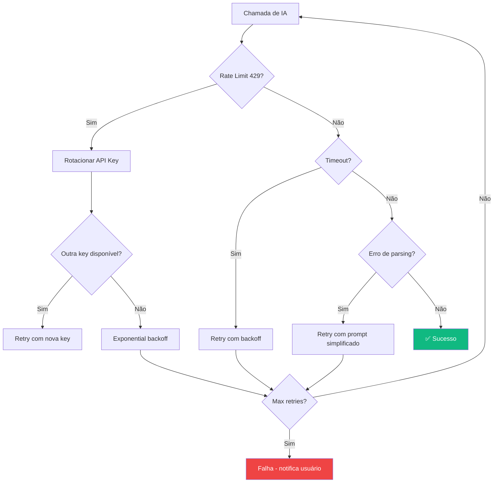

# 09 — Integrações de IA

> Provedores de IA, contratos, estratégias de fallback, retry e streaming.

---

## 9.1 Visão Geral dos Provedores

O RSAC V2 mantém e expande o suporte multi-provedor da V1:

| Provedor | Tipo | Modelos | Custo |
|----------|------|---------|-------|
| **Google Gemini** | Nuvem | gemini-2.5-flash, gemini-3.6-flash | Grátis (tier) / Pago |
| **Alibaba Qwen** | Nuvem | qwen3.8-max, qwen-plus, qwen-turbo | Pago (DashScope) |
| **Local OpenAI-Compatible** | Local | Ternary Bonsai 4B/8B, Ollama, LM Studio | Gratuito |

---

## 9.2 Contrato do Cliente de IA

```python
# infrastructure/ai/base_client.py

from abc import ABC, abstractmethod
from typing import Dict, Any, AsyncIterator, Optional
from app.domain.entities import Paper, Protocol

class BaseAIClient(ABC):
    """Contrato unificado para todos os provedores de IA no RSAC V2."""

    @abstractmethod
    async def analyze_screening(
        self,
        paper: Paper,
        protocol: Protocol,
    ) -> Dict[str, Any]:
        """
        Triagem de um paper (Fase 1 ou 2).

        Returns:
            {
                "decisao": "Incluído" | "Excluído" | "Pendente",
                "criterios_inclusao": {"crit_name": True/False, ...},
                "criterios_exclusao": {"crit_name": True/False, ...},
                "justificativa": "string com justificativa",
                "confianca": 0.0-1.0
            }
        """
        ...

    @abstractmethod
    async def generate_protocol(
        self,
        theme_description: str,
        methodology: str,
        language: str = "pt-BR",
    ) -> Dict[str, Any]:
        """
        Gera um protocolo de revisão sistemática a partir da descrição do tema.

        Returns:
            {
                "questoes_pesquisa": [...],
                "criterios_inclusao": [...],
                "criterios_exclusao": [...],
                "descritores": {"pt": [...], "en": [...], "es": [...]},
                "questoes_extracao": [...]
            }
        """
        ...

    @abstractmethod
    async def extract_from_pdf(
        self,
        pdf_text: str,
        questions: list[str],
        paper_metadata: Dict[str, Any],
    ) -> Dict[str, str]:
        """
        Extrai respostas para questões de extração a partir do texto de um PDF.

        Returns:
            {"pergunta_1": "resposta_1", "pergunta_2": "resposta_2", ...}
        """
        ...

    @abstractmethod
    async def generate_json(
        self,
        prompt: str,
        system_instruction: str = "",
    ) -> Dict[str, Any]:
        """
        Gera uma resposta JSON estruturada para um prompt livre.
        """
        ...

    @abstractmethod
    async def test_connection(self) -> bool:
        """Testa se a conexão com o provedor está funcional."""
        ...

    @property
    @abstractmethod
    def provider_name(self) -> str:
        """Nome legível do provedor (ex: 'Google Gemini')."""
        ...

    @property
    @abstractmethod
    def model_name(self) -> str:
        """Nome do modelo em uso (ex: 'gemini-2.5-flash')."""
        ...
```

---

## 9.3 Estratégia de Fallback e Retry



### Configuração de Retry

```python
# infrastructure/ai/retry.py

from dataclasses import dataclass

@dataclass(frozen=True)
class RetryConfig:
    max_retries: int = 3
    initial_delay_seconds: float = 1.0
    max_delay_seconds: float = 60.0
    exponential_base: float = 2.0
    retry_on_status_codes: tuple[int, ...] = (429, 500, 502, 503)
    rotate_keys_on_429: bool = True
```

---

## 9.4 Rotação de API Keys

```python
# infrastructure/ai/key_manager.py

import asyncio
from collections import deque
from typing import Optional

class APIKeyManager:
    """Gerencia múltiplas API keys com rotação automática."""

    def __init__(self, keys: list[str]):
        self._keys = deque(keys)
        self._lock = asyncio.Lock()
        self._exhausted: set[str] = set()

    async def get_key(self) -> Optional[str]:
        """Retorna a próxima key disponível."""
        async with self._lock:
            for _ in range(len(self._keys)):
                key = self._keys[0]
                if key not in self._exhausted:
                    return key
                self._keys.rotate(-1)
            return None  # todas exaustas

    async def mark_rate_limited(self, key: str) -> None:
        """Marca uma key como rate-limited e rotaciona."""
        async with self._lock:
            self._exhausted.add(key)
            self._keys.rotate(-1)

    async def reset_all(self) -> None:
        """Reseta o estado de todas as keys."""
        async with self._lock:
            self._exhausted.clear()
```

---

## 9.5 Prompts e System Instructions

### 9.5.1 Triagem Fase 1 (Título + Resumo)

```python
SCREENING_SYSTEM_INSTRUCTION = """
Você é um pesquisador sênior especialista em Revisões Sistemáticas da Literatura.
Sua tarefa é analisar um artigo científico (título e resumo) e decidir se ele
atende aos critérios de inclusão e exclusão definidos no protocolo.

REGRAS:
1. Analise EXCLUSIVAMENTE o título e o resumo fornecidos.
2. NÃO invente informações que não estejam no texto.
3. Se o resumo for insuficiente para decisão, responda "Pendente".
4. Justifique sua decisão com citação direta do texto.
5. Responda APENAS em formato JSON válido.
"""

SCREENING_PROMPT_TEMPLATE = """
## Protocolo
Objetivo: {objective}

Critérios de Inclusão:
{inclusion_criteria}

Critérios de Exclusão:
{exclusion_criteria}

## Artigo para Análise
Título: {title}
Autores: {authors}
Ano: {year}
Resumo: {abstract}

## Resposta Esperada (JSON)
{{
    "decisao": "Incluído" | "Excluído" | "Pendente",
    "criterios_inclusao": {{"critério_1": true/false, ...}},
    "criterios_exclusao": {{"critério_1": true/false, ...}},
    "justificativa": "Justificativa com ancoragem no texto",
    "confianca": 0.0-1.0
}}
"""
```

### 9.5.2 Geração de Protocolo

```python
PROTOCOL_SYSTEM_INSTRUCTION = """
Você é um metodologista sênior especialista em Revisões Sistemáticas.
Sua tarefa é gerar um protocolo de pesquisa completo a partir da
descrição do tema fornecida pelo pesquisador.

REGRAS:
1. Siga estritamente a metodologia selecionada ({methodology}).
2. Os descritores de busca devem ser formulados em PARES (máx. 2 termos):
   "termo_1" AND "termo_2". NUNCA 3+ termos por expressão.
3. Máximo 5 pares de descritores por idioma.
4. Os critérios devem ser objetivos e verificáveis.
5. As questões de extração devem ser respondíveis a partir do texto integral.
"""
```

---

## 9.6 Streaming de Respostas

Para triagem em lote, o backend reporta progresso via WebSocket:

```python
# services/screening_service.py

async def screen_batch(
    self,
    project_id: str,
    task_id: str,
    ws_manager: WebSocketManager,
) -> BatchResult:
    papers = await self.repo.get_pending_papers(project_id)

    for idx, paper in enumerate(papers, 1):
        if self._cancel_requested(task_id):
            break

        result = await self.ai_client.analyze_screening(paper, protocol)
        updated = self._apply_guardrails(paper, result)
        await self.repo.update_paper(updated)

        # Notifica progresso via WebSocket
        await ws_manager.send(task_id, {
            "type": "screening:progress",
            "current": idx,
            "total": len(papers),
            "paper_id": paper.id,
            "decision": updated.decision.value,
        })

    await ws_manager.send(task_id, {
        "type": "task:completed",
        "task_id": task_id,
    })
```

---

## 9.7 Configuração no Frontend

```typescript
// types/api.ts

interface AIConfig {
  provider: 'gemini' | 'qwen' | 'local';
  api_keys: string[];       // múltiplas keys para rotação
  model: string;
  endpoint?: string;         // para provedores locais
  temperature: number;       // 0.0 - 1.0
  max_tokens: number;
}

// Tela de configuração permite:
// 1. Selecionar provedor
// 2. Adicionar/remover API keys
// 3. Selecionar modelo
// 4. Testar conexão com feedback visual
// 5. Configurar endpoint custom (para local)
```
