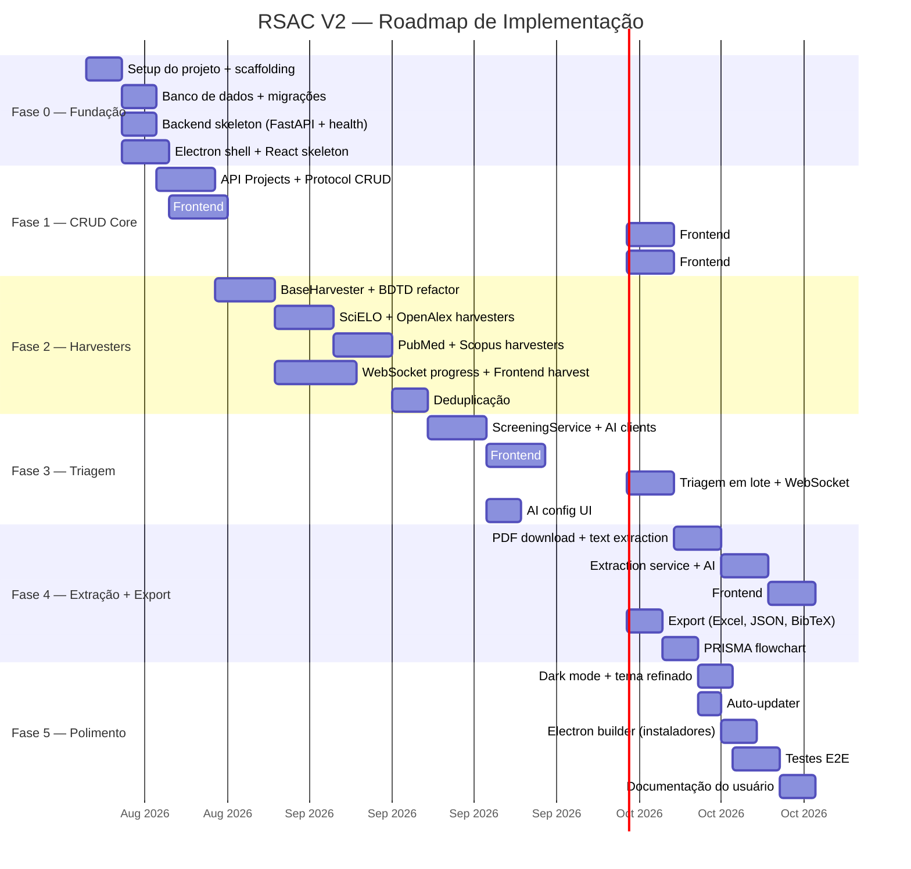

# 12 — Roadmap e Fases de Implementação

> Cronograma de implementação dividido em fases incrementais.

---

## 12.1 Visão Geral das Fases

---

## 12.2 Detalhamento por Fase

---

### 🏗️ Fase 0 — Fundação (≈ 1 semana)

**Objetivo**: Criar o esqueleto funcional do projeto com comunicação Backend ↔ Electron verificada.

| # | Tarefa | Entregável |
|---|--------|------------|
| 0.1 | Criar estrutura de diretórios (backend + frontend) | Árvore de pastas |
| 0.2 | Configurar `pyproject.toml` com dependências Python | Ambiente Python funcional |
| 0.3 | Criar `app/main.py` (FastAPI app factory) | `GET /api/v1/health` respondendo |
| 0.4 | Configurar SQLAlchemy + Alembic + models iniciais | Banco SQLite criado com migrations |
| 0.5 | Scaffold Electron + React com `electron-vite` | `npm run dev` abrindo janela |
| 0.6 | Implementar `python-manager.ts` (spawn backend) | Electron spawna e mata Python |
| 0.7 | Implementar `preload.ts` (contextBridge) | API IPC exposta ao renderer |
| 0.8 | React faz GET /health e exibe status | Comunicação Backend→Electron OK |

**Critério de Aceite**: Abrir o Electron, ver o dashboard skeleton com "Backend: 🟢 Online".

---

### 📦 Fase 1 — CRUD Core (≈ 2.5 semanas)

**Objetivo**: Gerenciamento completo de projetos e protocolos (sem coleta nem triagem).

| # | Tarefa | Entregável |
|---|--------|------------|
| 1.1 | API CRUD projetos (`/projects`) | Endpoints REST funcionais |
| 1.2 | API CRUD protocolos (`/projects/{id}/protocol`) | Endpoints REST funcionais |
| 1.3 | Frontend: Design system (CSS vars, globals, componentes) | Button, Card, Badge, Input |
| 1.4 | Frontend: AppShell (Sidebar + Header + Breadcrumbs) | Layout responsivo navegável |
| 1.5 | Frontend: Dashboard page (contadores + cards) | Tela inicial funcional |
| 1.6 | Frontend: Project list + create + detail | CRUD visual completo |
| 1.7 | Frontend: Protocol form (metodologias, PICO, critérios) | Formulário completo |
| 1.8 | Integração IA para geração de protocolo | Botão "Gerar com IA" funcional |

**Critério de Aceite**: Criar um projeto, gerar protocolo com IA, salvar e reabrir.

---

### 🔍 Fase 2 — Harvesters (≈ 3 semanas)

**Objetivo**: Coleta automatizada em 5 bases com deduplicação e progresso em tempo real.

| # | Tarefa | Entregável |
|---|--------|------------|
| 2.1 | `BaseHarvester` ABC + factory | Contrato unificado |
| 2.2 | Portar + refatorar BDTD harvester | Harvester BDTD async |
| 2.3 | Portar + refatorar SciELO harvester | Harvester SciELO async |
| 2.4 | Portar + refatorar OpenAlex harvester | Harvester OpenAlex async |
| 2.5 | Portar + refatorar PubMed harvester | Harvester PubMed async |
| 2.6 | Portar + refatorar Scopus harvester | Harvester Scopus async |
| 2.7 | API endpoints harvesting + WebSocket | Progresso em tempo real |
| 2.8 | Frontend: Harvesting page (seleção de bases, progress bars) | UI de coleta |
| 2.9 | Serviço de deduplicação (3 passes) | Deduplicação funcional |
| 2.10 | Testes unitários dos harvesters (com mocks HTTP) | Cobertura ≥ 80% |

**Critério de Aceite**: Iniciar coleta em BDTD+SciELO, ver progresso live, resultado deduplicado.

---

### ✅ Fase 3 — Triagem (≈ 2.5 semanas)

**Objetivo**: Triagem manual e automatizada de papers com guardrails e multi-provedor de IA.

| # | Tarefa | Entregável |
|---|--------|------------|
| 3.1 | `BaseAIClient` ABC + Gemini client | Cliente Gemini funcional |
| 3.2 | Qwen client + Local client | Multi-provedor funcional |
| 3.3 | `ScreeningService` (single + batch) | Triagem com guardrails |
| 3.4 | API endpoints screening + WebSocket | Progress em lote |
| 3.5 | Frontend: Screening page (lista + detalhe + decisão) | UI de triagem |
| 3.6 | Frontend: Triagem em lote com progress bar | Batch funcional |
| 3.7 | Frontend: AI config page (provider, keys, test) | Config de IA completo |
| 3.8 | Rotação de keys + retry com backoff | Resiliência testada |

**Critério de Aceite**: Triar 50 papers em lote com IA, ver progresso, revisar decisões.

---

### 📄 Fase 4 — Extração e Exportação (≈ 3 semanas)

**Objetivo**: Leitura de PDFs, extração de dados com IA e exportação em múltiplos formatos.

| # | Tarefa | Entregável |
|---|--------|------------|
| 4.1 | PDF downloader (async, com retry) | Download funcional |
| 4.2 | PDF text extractor (PyMuPDF) | Extração de texto |
| 4.3 | `ExtractionService` (single + batch) | Extração com IA |
| 4.4 | API endpoints extraction | Endpoints REST |
| 4.5 | Frontend: Extraction page (PDF list + questões + respostas) | UI de extração |
| 4.6 | Export service (Excel, JSON, BibTeX) | 3 formatos de exportação |
| 4.7 | Frontend: Export page | UI de exportação |
| 4.8 | PRISMA flowchart component (Recharts/D3) | Flowchart interativo |
| 4.9 | Dashboard com gráficos reais | Gráficos funcionais |

**Critério de Aceite**: Extrair dados de 5 PDFs, exportar Excel com dados completos.

---

### ✨ Fase 5 — Polimento e Distribuição (≈ 2 semanas)

**Objetivo**: Refinar UX, implementar dark mode, auto-update e gerar instaladores.

| # | Tarefa | Entregável |
|---|--------|------------|
| 5.1 | Dark mode (CSS variables + toggle) | Tema escuro completo |
| 5.2 | Micro-animações (transições, hover, loading) | Animações suaves |
| 5.3 | Electron auto-updater (GitHub Releases) | Auto-update funcional |
| 5.4 | electron-builder config (Windows .exe, macOS .dmg, Linux .AppImage) | Instaladores |
| 5.5 | Testes E2E com Playwright | Fluxo principal coberto |
| 5.6 | GitHub Actions CI/CD (test + build + release) | Pipeline automatizado |
| 5.7 | Documentação do usuário (guia-usuario.md) | Documentação completa |
| 5.8 | README.md do projeto | README atualizado |

**Critério de Aceite**: Build do instalador Windows, instalar, usar fluxo completo.

---

## 12.3 Resumo de Estimativas

| Fase | Duração Estimada | Dependências |
|------|:----------------:|:------------:|
| Fase 0 — Fundação | ~1 semana | — |
| Fase 1 — CRUD Core | ~2.5 semanas | Fase 0 |
| Fase 2 — Harvesters | ~3 semanas | Fase 1 |
| Fase 3 — Triagem | ~2.5 semanas | Fase 2 |
| Fase 4 — Extração + Export | ~3 semanas | Fase 3 |
| Fase 5 — Polimento | ~2 semanas | Fase 4 |
| **Total** | **~14 semanas** | — |

> ⚠️ Estimativas para um desenvolvedor trabalhando em dedicação parcial. Com dedicação integral, pode ser reduzido para ~8-10 semanas.

---

## 12.4 Riscos e Mitigações

| Risco | Probabilidade | Impacto | Mitigação |
|-------|:------------:|:-------:|-----------|
| Complexidade de empacotamento Python + Electron | Alta | Alto | Testar empacotamento na Fase 0, não deixar para o final |
| Rate limits de APIs de IA | Média | Médio | Rotação de keys, cache de respostas, modo offline |
| Mudanças nas APIs dos harvesters (BDTD, SciELO) | Média | Alto | Testes automatizados com mocks, verificação periódica |
| Performance do SQLite com muitos papers (>50k) | Baixa | Médio | Índices otimizados, paginação, lazy loading |
| Tamanho do instalador (Python embedded + Node) | Média | Baixo | PyInstaller/PyOxidizer para bundle Python |

---

## 12.5 Decisão sobre Empacotamento do Python

O maior desafio técnico é distribuir o backend Python junto com o Electron. Opções:

| Opção | Prós | Contras |
|-------|------|---------|
| **PyInstaller → .exe embutido** | Experiência comprovada (V1 já usa) | Tamanho grande (~100MB) |
| **Python embarcado (embedded)** | Menor overhead | Gerenciamento manual de deps |
| **uv + venv bundled** | Flexível, atualização de deps | Requer Python instalado ou embarcado |
| **PyOxidizer** | Binário único, rápido | Complexidade de config |

**Decisão preliminar**: 🟡 **PyInstaller** para MVP (confiável), avaliar **PyOxidizer** como evolução.
