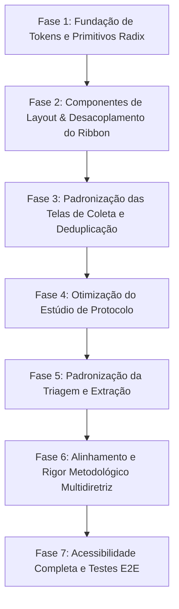

# 🚀 25 — Plano de Execução do Design System (Fases 1 a 7)

> **RSAC V2 — Revisão Sistemática Assistida por Computador**  
> **Data:** Agosto de 2026  
> **Status:** Vigente e Normativo  
> **Estratégia:** Evolução incremental em 7 fases sem big-bang, com portões de verificação a cada entrega.

---

## 1. Visão Geral das Fases

---

## 2. Detalhamento por Fase

### Fase 1: Fundação de Tokens e Primitivos Radix (Semana 1)
- **Objetivo**: Integrar as micro-escalas de fonte e espaçamento nos arquivos globais e criar os wrappers canônicos dos componentes Radix.
- **Entregáveis**:
  - `globals.css` atualizado com tokens `--font-size-3xs`, `--font-size-2xs`, `--font-size-xs-alt` e `--spacing-3xs`, `--spacing-xs-alt`.
  - Componentes primitivos criados em `frontend/src/components/ui/`: `Button`, `Tooltip`, `Dialog`, `Badge`, `EmptyState`.
  - Configuração do `sonner` para substituição de alertas invasivos.

### Fase 2: Componentes de Layout & Desacoplamento do Ribbon (Semana 2)
- **Objetivo**: Extinguir a busca por texto no DOM (`clickDomByText`) e otimizar a estrutura do shell.
- **Entregáveis**:
  - Store unificado de ações do Ribbon (`useRibbonActionStore` ou similar via Zustand).
  - Remoção completa de `clickDomByText` e `clickDomByIndex` no `TopRibbonBar.tsx`.
  - Expurgo definitivo dos arquivos mortos de Sidebar e referências residuais.

### Fase 3: Padronização das Telas de Coleta e Deduplicação (Semana 3)
- **Objetivo**: Unificar os formulários de busca, barras de progresso, logs e tabelas de resultados de coleta.
- **Entregáveis**:
  - `HarvestPage.tsx` e `DeduplicationPage.tsx` migrados para usar `<Button>`, `<Badge>` e `<EmptyState>`.
  - Adoção do `@tanstack/react-table` nas listas de estudos coletados.

### Fase 4: Otimização do Estúdio de Protocolo (Semana 4)
- **Objetivo**: Reduzir a ocupação de moldura vertical de 42% para menos de 25%, maximizando a área útil do editor.
- **Entregáveis**:
  - Modo de foco e recolhimento inteligente do cabeçalho do protocolo.
  - Abas e painéis migrados para `@radix-ui/react-tabs`.
  - Organização visual com inputs responsivos de alta densidade.

### Fase 5: Padronização da Triagem e Extração (Semana 5)
- **Objetivo**: Padronizar as telas de decisão rápida (Triagem 1) e extração estruturada de evidências com texto completo (Triagem 2).
- **Entregáveis**:
  - Botoeira de decisão (`Incluir`, `Excluir`, `Pendente`) migrada para variantes semânticas do `<Button>`.
  - Modal de visualização de PDF integrado com atalhos de teclado declarativos.

### Fase 6: Alinhamento e Rigor Metodológico Multidiretriz (Semana 6)
- **Objetivo**: Garantir que toda a interface reflita com precisão a diretriz ativa do projeto (CEE/ROSES, PRISMA 2020, Campbell, JBI, etc.).
- **Entregáveis**:
  - Dinamização completa de cabeçalhos de checklist, contadores de itens e caixas de ajuda no Protocolo e no Ribbon.
  - Eliminação de qualquer menção hardcoded a "PRISMA-ScR (22 itens)" quando outras diretrizes estiverem selecionadas.

### Fase 7: Acessibilidade Completa e Testes E2E (Semana 7)
- **Objetivo**: Fechar os requisitos de acessibilidade WCAG 2.1 AA e validar o fluxo ponta a ponta.
- **Entregáveis**:
  - Anéis de foco e navegação completa por teclado (Tab, Arrow keys, Enter/Esc).
  - Cobertura de 100% dos botões de ícone com `aria-label`.
  - Suíte de testes automatizados E2E cobrindo a jornada de ponta a ponta.
