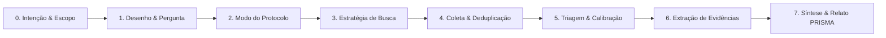
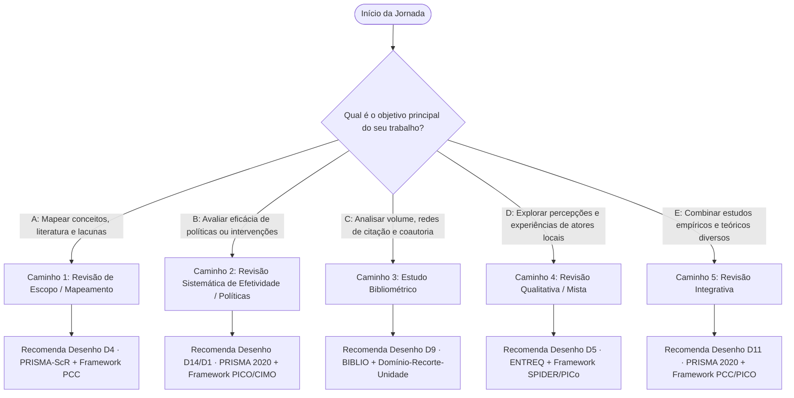
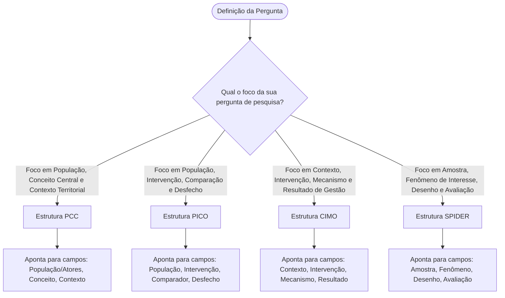
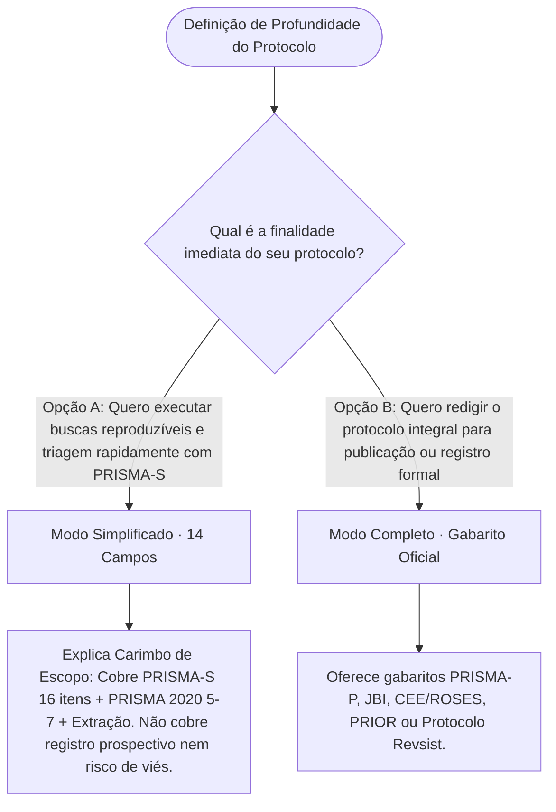
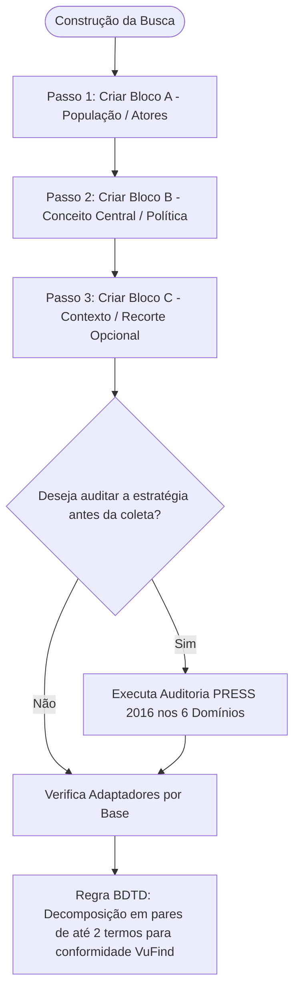
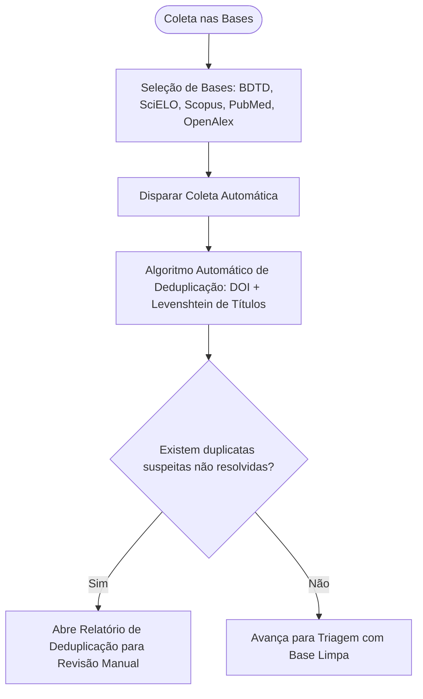
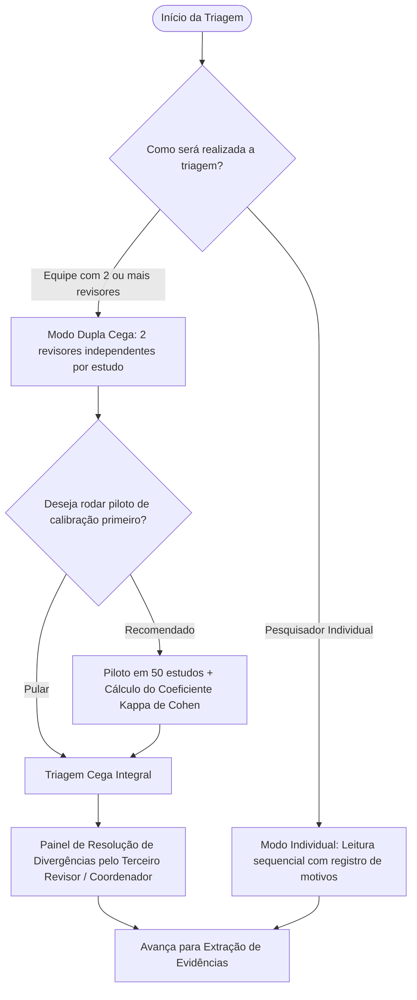
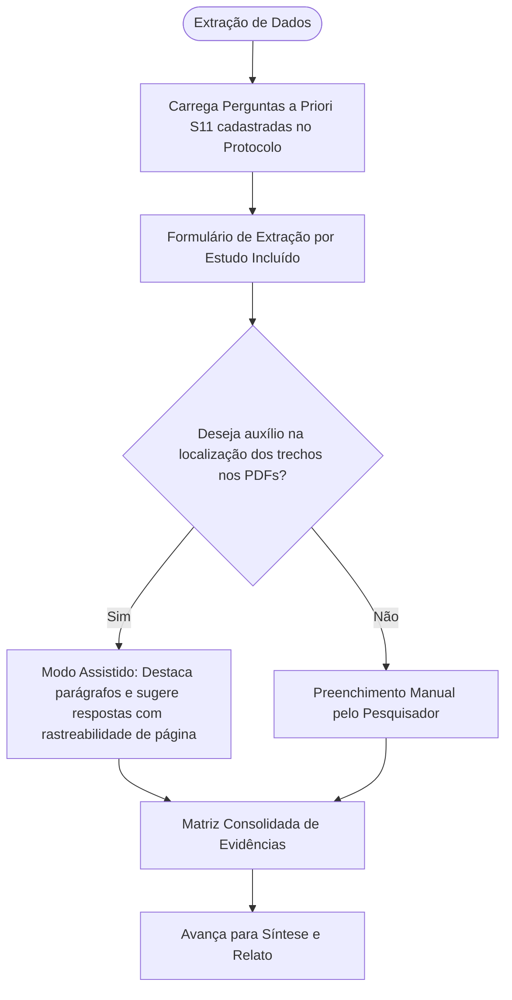
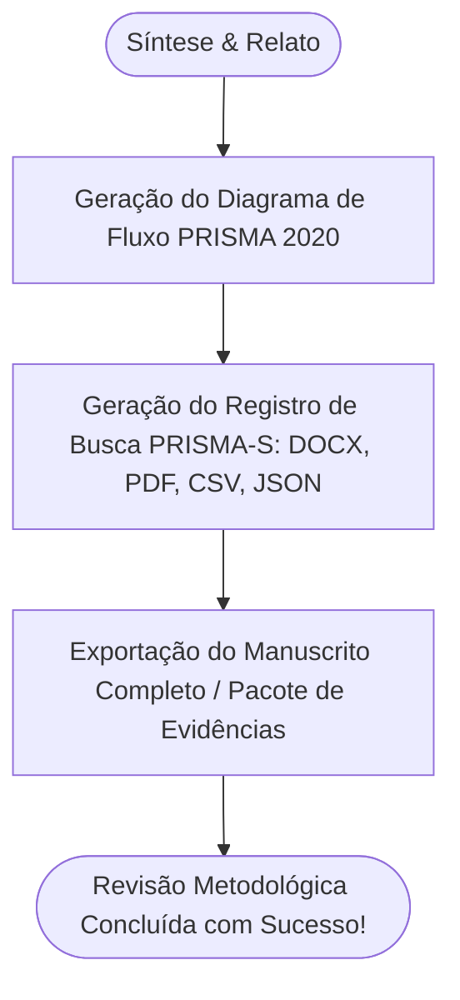

# 46 — Plano do Modo Trilho: Tutor Metodológico Guiado

> **Status:** 🟡 Proposta de Especificação e Arquitetura.
> **Conceito Central:** Modo de navegação assistida e tutoria metodológica passo a passo ("Modo Trilho"), operando como um tutor experiente ao lado do pesquisador, destacando elementos na tela, explicando o porquê de cada etapa e oferecendo bifurcações determinísticas de tomada de decisão.
> **Regra de Ouro:** **100% Determinístico, ZERO Inteligência Artificial.** Toda orientação, árvore de decisão, recomendação de bifurcação e checklist decorre estritamente da literatura metodológica consolidada (PRISMA, JBI, Cochrane, MECIR, Galvão & Pereira, CEE, SPAR-4-SLR).
> **Domínio de Aplicação:** Ciências Sociais Aplicadas & Desenvolvimento Regional (conforme `.agents/AGENTS.md`).

---

## 1. Sumário Executivo & Princípio de Concepção

Uma das maiores dores de pesquisadores em revisões sistemáticas e de escopo é a **ansiedade metodológica**: *O que devo preencher agora? Por que este campo é necessário? Qual caminho devo escolher entre desenho X e Y? Minha busca está correta? Como calibro a triagem?*.

O **Modo Trilho** transforma o Revsist em um **ambiente de tutoria metodológica ativa**. Não se trata de um simples "tour de onboarding" que o usuário fecha no primeiro clique, mas de uma **camada de acompanhamento contínuo e contextual** que pode ser ligada ou pausada a qualquer momento através do alternador `[ Modo Trilho: Ativo / Pausado ]`.

```
┌────────────────────────────────────────────────────────────────────────────┐
│ MODO TRILHO: TUTOR METODOLÓGICO ATIVO                                     │
│                                                                            │
│ ┌──────────────┐     ┌─────────────────────┐     ┌───────────────────────┐ │
│ │  Spotlight   │ ──> │   Painel do Tutor   │ ──> │ Árvore de Decisão     │ │
│ │ (Foco visual │     │ (Explicação 'o quê' │     │ (Bifurcação A vs B    │ │
│ │   no campo)  │     │   e 'por que')      │     │  sem IA, determinista)│ │
│ └──────────────┘     └─────────────────────┘     └───────────────────────┘ │
└────────────────────────────────────────────────────────────────────────────┘
```

---

## 2. As 7 Etapas da Jornada Metodológica no Modo Trilho

O Trilho organiza toda a construção da revisão em **7 Etapas Sequenciais**, baseadas nos 8 passos canônicos de Galvão & Pereira (2014) e nos portões do pipeline do Revsist:



---

## 3. Fluxograma Completo de Bifurcações e Tomadas de Decisão

### 3.1. Etapa 0: Intenção & Escopo da Pesquisa



---

### 3.2. Etapa 1: Desenho Metodológico & Framework de Pergunta

Quando o usuário está no Estúdio de Protocolo, o Tutor abre a **Bifurcação de Seleção de Framework**:



**Explicação Metodológica do Tutor:**
- *Se Revisão de Escopo (D4)*: "Em Ciências Sociais e Desenvolvimento Regional, revisões de escopo utilizam prioritariamente o framework **PCC (População, Conceito e Contexto)** recomendado pelo JBI Manual 2024. Exemplo: *População*: Cooperativas da agricultura familiar; *Conceito*: Governança territorial e inovação; *Contexto*: Semiárido brasileiro."
- *Se Avaliação de Políticas (D14)*: "Para analisar políticas territoriais, o framework **CIMO (Contexto, Intervenção, Mecanismo e Outcome)** de Denyer & Tranfield (2009) é ideal para capturar o contexto institucional e os mecanismos de governança pública."

---

### 3.3. Etapa 2: Escolha do Modo do Protocolo (Simplificado vs. Completo)



---

### 3.4. Etapa 3: Estúdio de Busca Canônica & Decomposição em Pares



**Regras e Dicas do Tutor:**
- **Diretriz de Descritores**: Máximo de 2 termos por expressão booleana (ex: `"termo_1" AND "termo_2"`), no máximo 5 pares por idioma, evitando termos excessivamente genéricos ou restritivos.
- **Auditoria PRESS**: Verifica se há truncamentos ausentes, operadores booleanos invertidos ou parênteses desbalanceados.

---

### 3.5. Etapa 4: Coleta de Dados nas Bases & Deduplicação



---

### 3.6. Etapa 5: Triagem (Screening) & Calibração



---

### 3.7. Etapa 6: Extração de Evidências & Matriz de Dados



---

### 3.8. Etapa 7: Síntese, Indicadores & Relato PRISMA



---

## 4. Especificação de Interface & Componentes Visuais (UI/UX)

### 4.1. Barra Flutuante / Dockable do Tutor (`TrilhoTutorBar`)
- **Posicionamento**: Barra inferior ou lateral retrátil, com visual Neo-Retro contemporâneo.
- **Elementos**:
  1. **Indicador de Fase & Progresso**: `[ Etapa 2 de 7: Estúdio de Busca Canônica ]` com barra de progresso.
  2. **Card "O que fazer agora"**: Instrução direta em 1 frase imperativa e clara.
  3. **Card "Por que fazer assim"**: Justificativa acadêmica curta com citação da diretriz (ex: *PRISMA-S item 3*).
  4. **Botão de Ação Direta**: `[ Focar no Campo ]` / `[ Abrir Bifurcação de Decisão ]`.
  5. **Controles de Navegação**: `[ < Anterior ]`, `[ Próximo > ]`, `[ Pausar Trilho ]`.

### 4.2. Sistema de Destaque Visual (`TrilhoSpotlight`)
- Utiliza atributos de dados nos elementos da interface: `data-trilho-target="protocol-objective"`, `data-trilho-target="search-blocks"`, `data-trilho-target="criteria-list"`, etc.
- Efeito de **coachmark com contorno de foco acolhedor** e badge indicativo flutuante sem escurecer agressivamente a tela, mantendo a legibilidade integral.

### 4.3. Modal de Bifurcação Metodológica (`TrilhoDecisionModal`)
- Quando a jornada atinge um ponto de escolha (ex: Escolha de Desenho, PCC vs PICO, Individual vs Dupla Cega), o modal apresenta **cartões comparativos lado a lado**:
  - **Opção A** vs **Opção B**.
  - *Quando escolher cada uma*.
  - *Exemplo prático em Ciências Sociais / Desenvolvimento Regional*.
  - *Impacto no fluxo de trabalho*.
  - Botão de aplicação direta que atualiza a configuração do projeto de forma transparente.

---

## 5. Arquitetura de Dados e Gerenciamento de Estado

### 5.1. Grafo do Trilho (`frontend/src/data/trilhoGraph.ts`)
Cada nó do grafo contém:
```typescript
export interface TrilhoNode {
  id: string
  phase: number
  title: string
  instruction: string
  rationale: string
  guidelineReference: string
  targetElementSelector?: string
  targetPageUrl?: string
  branchingQuestion?: {
    questionText: string
    options: {
      id: string
      label: string
      badge?: string
      description: string
      example: string
      consequences: string
      onSelectAction: (context: any) => Promise<void> | void
      nextNodeId: string
    }[]
  }
  validationRule?: (context: any) => { passed: boolean; message?: string }
  nextNodeId?: string
  previousNodeId?: string
}
```

### 5.2. Store Zustand (`frontend/src/stores/useTrilhoStore.ts`)
- `isActive: boolean`
- `currentNodeId: string`
- `completedNodes: string[]`
- `decisionHistory: Record<string, string>`
- `isMinimized: boolean`
- Ações: `startTrilho(nodeId?)`, `goToNext()`, `goToPrevious()`, `chooseBranch(optionId)`, `toggleTrilho()`, `minimize()`.
- Persistência sincronizada com o projeto ativo.

---

## 6. Plano de Execução em 4 Fases

| Fase | Escopo | Entregáveis |
|---|---|---|
| **Fase 1** | **Grafo Metodológico & Árvore de Decisão** | Arquivo `trilhoGraph.ts` completo com todos os nós, bifurcações, racional metodológico e validações determinísticas. |
| **Fase 2** | **Estado & Componentes de UI do Trilho** | `useTrilhoStore.ts`, `TrilhoTutorBar.tsx`, `TrilhoDecisionModal.tsx`, `TrilhoSpotlight.tsx` e `Trilho.css`. |
| **Fase 3** | **Instrumentação das Telas do Revsist** | Inclusão de `data-trilho-target` em `ProtocolPage`, `SearchStrategyStudio`, `HarvestingPage`, `ScreeningPage`, `ExtractionPage`, `InsightsPage`. |
| **Fase 4** | **Testes de Usabilidade, Acessibilidade & Validação** | Testes de navegação em todos os caminhos da árvore de decisão, validação de contrastes, modo teclado e build limpo. |

---

## 7. Critérios de Aceite e Conformidade

1. **Determinismo Absoluto**: Nenhuma chamada a modelos generativos ou provedores de IA para direcionar o Trilho. Todas as decisões e caminhos são regras metodológicas transparentes e auditáveis.
2. **Não-intrusividade**: O pesquisador pode ativar, pausar, avançar ou retroceder no Trilho a qualquer momento sem perder o trabalho preenchido.
3. **Aderência Normativa**: Toda justificativa ("por que fazer assim") cita diretrizes acadêmicas reconhecidas (PRISMA, JBI, Cochrane, etc.).
4. **Design System Integrado**: Todos os estilos utilizam estritamente a paleta e os tokens do Design System Neo-Retro Contemporâneo do Revsist.
